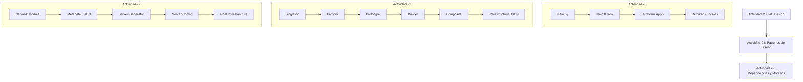
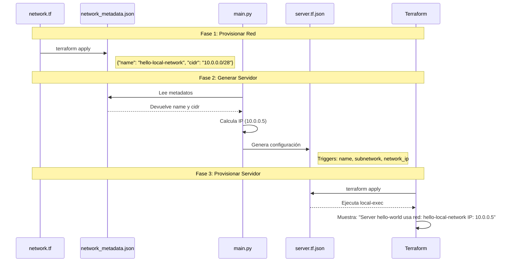
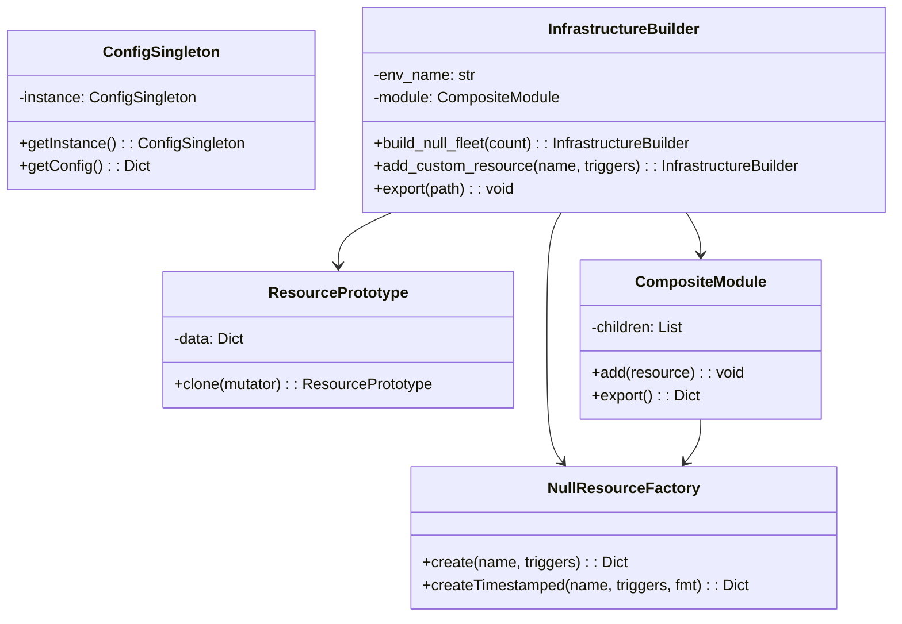
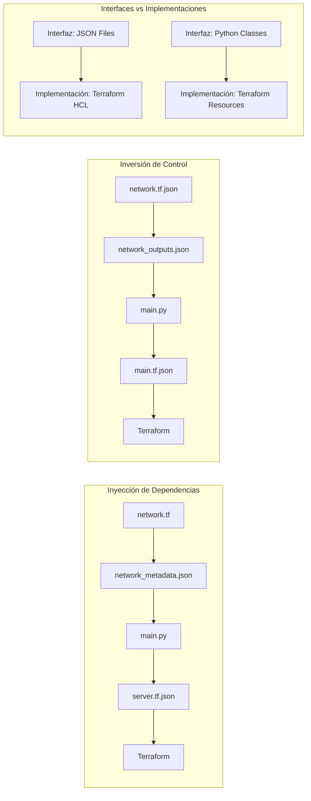
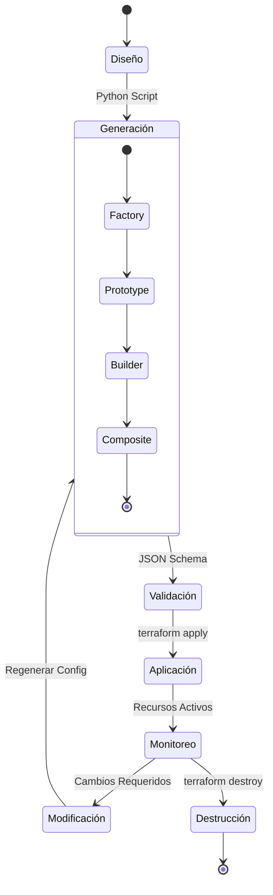
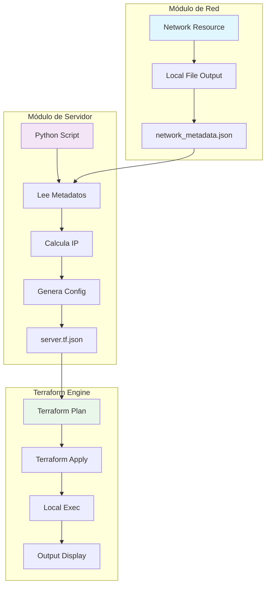
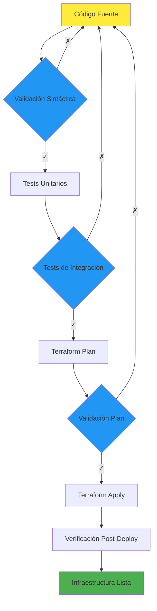

# Diagrama de Flujo del Proyecto

## Flujo General del Sistema

## Flujo Detallado - Inyección de Dependencias (Actividad 22)

## Arquitectura de Patrones (Actividad 21)

## Flujo de Datos - Patrones de Dependencias

## Ciclo de Vida del Recurso

## Patrón de Comunicación entre Módulos

## Matriz de Responsabilidades

| Componente | Responsabilidad | Entrada | Salida |
|------------|----------------|---------|--------|
| **network.tf** | Definir infraestructura de red | Variables Terraform | network_metadata.json |
| **main.py** | Lógica de negocio | network_metadata.json | server.tf.json |
| **server.tf.json** | Configuración del servidor | Triggers generados | Recursos Terraform |
| **Terraform** | Orquestación | Archivos .tf/.tf.json | Infraestructura real |
| **Factory** | Creación de recursos | Parámetros | Configuración JSON |
| **Builder** | Composición fluida | Configuraciones | Módulo completo |
| **Composite** | Agrupación | Recursos individuales | Módulo agrupado |

## Flujo de Validación y Testing

Esta documentación visual complementa el flujo textual y proporciona una comprensión clara de la arquitectura y los flujos de datos del proyecto.