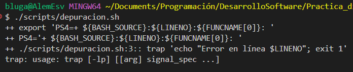

# Herramientas del shell

1 . escribe un comando `ls` que liste archivos de la siguiente manera:

- Incluye todos los archivos, incluidos los ocultos.

- Los tamaños aparecen en formato legible por humanos (p. ej. 454M en lugar de 454279954).

- Los archivos se ordenan por fecha de modificación (del más reciente al más antiguo).

- La salida está coloreada.

```bash

$ ls -alh --sort=time --color=auto
total 5.0K
drwxr-xr-x 1 bluga 197609  0 May  1 12:28 ./
-rw-r--r-- 1 bluga 197609 15 May  1 12:28 README.md
drwxr-xr-x 1 bluga 197609  0 May  1 12:10 ../
```

## Bash

### Paso 1. Verificar la versión de bash

```bash
$ bash --version

GNU bash, version 5.2.37(1)-release (x86_64-pc-msys)
Copyright (C) 2022 Free Software Foundation, Inc.
License GPLv3+: GNU GPL version 3 or later <http://gnu.org/licenses/gpl.html>
```

### Paso 2. Primer script

```bash
nano hello.sh
# Colocar primer "Hola mundo"
chmod +x hello.sh
./hello.sh
```


### Paso 3. Asignación de variables

Creación del archivo `variables.sh` para conocer las diferentes variables usadas en `bash`.

```bash
#!/usr/bin/env bash
nombre="Alem"
readonly PI=3.14159
export env="producción"
set -u # existencia de errores en variables
echo "Usuario: $nombre"
echo "PI value: $PI"
echo "Entorno: $env"
```

Guardado, habilitación y ejecución del script:

```bash
chmod +x scripts/variables.sh
./scripts/variables.sh
```


### Paso 4. Parámetros posicionales

Script `parametros.sh` para la lectura de parametros.

```bash
#!/usr/bin/env bash

# $0,1...n : parametros
# $@: todos los parametros

echo "Script: $0"
echo "1er parámetro: $1"
echo "Todos: $@"
echo "Cantidad: $#"
shift 1
echo "Ahora \$1 es: $1"
```

Ejecución:

```bash
./scripts/parametros.sh f1 f2 f3
```


### Paso 5. Arrays en Bash

Uso de arreglos en bash

```bash
#!/usr/bin/env bash
FRUTAS=(manzana banana cereza)
FRUTAS+=("durazno")
echo "Total frutas: ${#FRUTAS[@]}"
for f in "${FRUTAS[@]}"; do
  echo "Fruta: $f"
done
# array de 2 items
declare -A EDADES=([Alice]=28 [Alem]=21)
echo "Alem tiene ${EDADES[Alem]} años"
```

### Paso 6. Expansiones

```bash
# operaciones basicas
a=7; b=3
echo "$a + $b = $((a + b))"
echo "$a - $b = $((a ** b))"
echo "$a ** $b = $((a ** b))"
#sustitución de comandos
fecha=$(date +%Y-%m-%d)
archivos=$(ls | wc -l)
echo "Hoy: $fecha, Archivos: $archivos"
#otros
VAR=""
echo "${VAR:-default}" # default si VAR vacío
txt="archivo.tar.gz"
echo "${txt%.tar.gz}" # quita sufijo
```

Resultados:


### Paso 7. Pipes y redirección

```bash
# listado de archivos y guardado
ls -l > listado.txt
# Busqueda de f1 en logs y guardado
grep f1 *.log 2> errores.log
# ambos
make &> build.log
# pipe
# lista, filtra y extrae el segundo campo de los procesos
ps aux | grep sshd | awk '{print $2}'
# sustitución
# sort: ordena archivos
diff <(sort file1) <(sort file2)
```

resultados:

- build.log

```bash
./scripts/redirecciones.sh: line 6: make: command not found
```

- errores.log

Carpeta vacia por no existir `f1` en los logs

- listado.txt

```bash
total 13
-rw-r--r-- 1 bluga 197609   60 May  1 14:47 build.log
drwxr-xr-x 1 bluga 197609    0 May  1 12:43 docs
-rw-r--r-- 1 bluga 197609    0 May  1 14:47 errores.log
-rw-r--r-- 1 bluga 197609    0 May  1 14:47 listado.txt
-rw-r--r-- 1 bluga 197609 5172 May  1 14:43 README.md
drwxr-xr-x 1 bluga 197609    0 May  1 14:43 scripts
```

al no tener los archivos `file1` y `file2` la salida del script es la siguiente:


### Paso 8. Condicionales

Uso de condicionales `if` y `case`

```bash
#!/usr/bin/env bash
num=$1
# [[-z]]: verifica si la cadena está vacia
# if:
if [[ -z $num ]]; then
  echo "Pasa un número"
  exit 1
elif (( num % 2 == 0 )); then
  echo "$num es par"
else
  echo "$num es impar"
fi
# case:
exit="$2"
case "$exit" in
  txt) echo "Texto" ;;
  sh)  echo "Shell" ;;
  py)  echo "Python" ;;
  *)   echo "Desconocido" ;;
esac
```

salida:


### Paso 9. Bucles

Diferentes tipos de bucles en bash.

```bash
#!/usr/bin/env bash
# for clásico
for ((i=1;i<=3;i++)); do echo "Iter $i"; done

# for-in
for file in *.sh; do echo "Script: $file"; done

# while
count=3
while (( count>0 )); do echo "$count"; ((count--)); done

# [[-f]]: existencia de un archivo
# until
until [[ -f resultado.txt ]]; do sleep 1; done 
echo "resultado.txt listo"
```

resultado:


### Paso 10. Funciones

```bash
#!/usr/bin/env bash
saludar() {
  local name=$1
  echo "Hola, $name!"
}
saludar "Alem"

dividir() {
  local a=$1 b=$2
  (( b==0 )) && return 1
  echo "$((a/b))"
}
if res=$(dividir 10 2); then
  echo "División: $res"
else
  echo "Error división"
fi
```


### Paso 11. Depuración

```bash

set -xe  # traza + salir al error
export PS4='+ ${BASH_SOURCE}:${LINENO}:${FUNCNAME[0]}: '
trap 'echo "Error en línea $LINENO"; exit 1' 
ERR
```



### Paso 12. Expresiones regulares en Bash

```bash
#!/usr/bin/env bash
email="$1"
re='^[[:alnum:]_.+-]+@[[:alnum:]-]+\.[[:alnum:].-]+$'
if [[ $email =~ $re ]]; then
  echo "Email válido"
  echo "Usuario: ${BASH_REMATCH[1]}"  # primer grupo
else
  echo "Email inválido"
fi
```

Salida de diferencias entre `if` y `else`:


### Paso 13. Expresiones regulares en Python

```bash
#!/usr/bin/env python3
import re, sys
texto=sys.stdin.read()
# expresion regular para extraer un correo: usuario.nombre+extra@mail-ejemplo.com
pat=re.compile(r'([A-Za-z0-9_.+-]+@[A-Za-z0-9-]+\.[A-Za-z0-9-.]+)')
for email in set(pat.findall(texto)):
    print(email)
```

archivo `logs.txt` donde estarán los correos.

```txt
cinver.espinoza.v@uni.pe 
correoejemplo@gmail.com 
correoejemplo2@hotmail.com 
nosoyuncorreo
```


### Paso 14. BDD con `behave`

### Paso 15. Pipelines `CI`

--------

Work in progress

## Ejercicios

### 1. Escribe funciones de Bash `marco` y `polo` que hagan lo siguiente: cada vez que ejecutes `marco`, debe guardarse de alguna manera el directorio de trabajo actual, luego, cuando ejecutes `polo`, sin importar en qué directorio te encuentres, `polo` te debe devolver (con `cd`) al directorio en el que ejecutaste `marco`. Para facilitar la depuración, puedes poner el código en un archivo `marco.sh` y recargarlo con source `marco.sh`

```bash
#!/usr/bin/env bash
marco(){
    # variable global
    export MARCO_DIR="$PWD"
    echo "Estás en el directorio: $MARCO_DIR"
}
polo(){
    cd "$MARCO_DIR"
    echo "Se retornó al directorio: $MARCO_DIR"
}
```


### 2. Tienes un comando que falla muy raramente. Para depurarlo necesitas capturar su salida, pero puede llevar tiempo que falle. Escribe un script de Bash que ejecute el siguiente fragmento **hasta que falle**, capture sus flujos de salida estándar y de error en archivos, y finalmente imprima todo


### 3. El `-exec` de `find` puede ser muy poderoso para realizar operaciones sobre los archivos que encuentra. Sin embargo, ¿qué pasa si queremos hacer algo con todos los archivos, como crear un archivo ZIP? Algunos comandos leen de **STDIN**, pero otros (como `tar`) necesitan recibir la lista de archivos como argumentos. Para unir ambos mundos tenemos `xargs`, que ejecuta un comando tomando su **STDIN** como lista de argumentos

```bash
find . -type f -name "*.html" -print0 | zip html_files.zip -@
```


### 4. Escribe un comando o script que, de forma recursiva, encuentre el archivo más recientemente modificado en un directorio. Y, más en general, ¿puedes listar todos los archivos por orden de recencia?

Mediante el comando `find` se puede encontrar el archivo más recientemente modificado.

```bash
find . -type f -printf '%T@ %p\n' | sort -nr
```

Se especifica `printf '%T@ %p\n'` para poder buscar al archivo modificado más recientemente, luego se ordena mediante el comando `sort -nr` para que sea de forma numérica, en orden descendente.

## Problemas

### Problema 1: Script de limpieza de ramas y atashes en Git

Construye un script Bash llamado clean_git.sh que automatice la limpieza de ramas locales y remotas y gestione stashes de forma interactiva, aplicando exclusivamente los conceptos de variables, parámetros posicionales, arrays, expansiones, pipes, condicionales, bucles, funciones y depuración.

### Problema 2: Hook Pre‑Commit y generador de reporte en Bash

Implementa un hook pre-commit en Bash que ejecute una serie de comprobaciones y, en caso de éxito, lance un script de generación de reporte del estado del repositorio, aplicando exclusivamente variables, arrays, loops, condicionales, expansiones y funciones de Bash.

### Problema 3: Generador de documentación automático

- Contexto: Cada vez que se añade o modifica un docstring en un archivo Python, quieres generar automáticamente un sitio estático de documentación.
