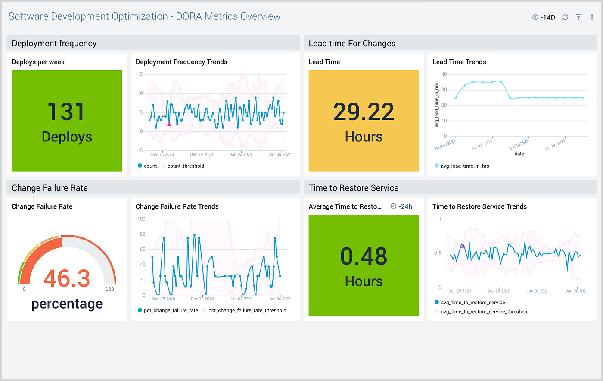

# Parte 1: preguntas de reflexión 
## 1. Por qué surgió la necesidad de DevOps en el desarrollo de software?
DevOps surgió para dar un enfoque laboral más interactivo, haciendo que diferentes partes de un equipo deban colaborar entre ellas para poder progresar de manera efectiva, mejorando la comunicación entre partes y haciendo que el desarrollo del software deje de estar aislado en cada equipo.
DevOps propone un enfoque colaborativo e integral, donde desarrollo, operaciones, seguridad y otras áreas trabajan juntas desde el inicio del ciclo de vida del software.Es un cambio cultural y técnico que busca acelerar la innovación sin comprometer la calidad.

## 2. Explica cómo la falta de comunicación y coordinación entre los equipos de desarrollo y operaciones en el pasado llevó a la creación de DevOps.
Por culpa de la falta de comunicación se vio como varias empresas dedicadas al desarrollo de software no eran capaces de gestionar bien sus recursos, ocasionando trabajos disparejos entre áreas, haciendo que haya una demora en la entrega del software, baja calidad en ciertas partes del equipo, entre otros problemas.
## 3. Describe cómo el principio de mejora continua impacta tanto en los aspectos técnicos como en los culturales de una organización.
Se busca tener un mayor control en cada parte del proyecto, uno como dev puede ver el trabajo de un operador en tiempo real y viceversa, pudiendo dar recomendaciones sobre el desarrollo de esa parte del proyecto como preguntar por dudas, enriqueciendo el conocimiento sobre el proyecto por parte de todo el equipo encargado
## 4. ¿Qué significa que DevOps no se trata solo de herramientas, individuos o procesos?
Es una manera por la cual puedes trabajar de forma conjunta haciendo uso de ciertas herramientas y procesos, puede ser tomado con un enfoque cultural laboral ya que se busca cambiar el esquema tradicional, cambiar el "chip" de todo el equipo, algo que no se podría lograr si DevOps fuera solo un conjunto de herramientas.
## 5. Según el texto, ¿cómo contribuyen los equipos autónomos y multifuncionales a una implementación exitosa de DevOps?
Facilitan la integración de desarrollo, pruebas y operaciones, reduciendo la dependencia de otras áreas y agilizando la entrega de software​. Esta autonomía mejora la velocidad de entrega, aumenta la eficiencia y reduce los cuellos de botella. Además, favorece una mayor responsabilidad sobre el producto, lo cual impulsa la calidad, la innovación y una respuesta más rápida ante cambios o incidentes.
# Parte 2: Preguntas de reflexión
## 1. ¿Qué significa "desplazar a la izquierda" en el contexto de DevSecOps y por qué es importante?
"Desplazar a la izquierda" significa integrar las prácticas de seguridad y calidad en las primeras fases del ciclo de vida del desarrollo de software, en lugar de dejarlas para el final. Esto permite identificar y corregir errores o vulnerabilidades desde etapas tempranas, lo que reduce costos, evita retrabajo, mejora la calidad del producto y acelera el tiempo de entrega.
## 2. Explica cómo IaC mejora la consistencia y escalabilidad en la gestión de infraestructuras.
Mediante el uso de una infraestructura como código podremos versionar de mejor manera, pudiendo dar una mayor consistencia en el desarrollo del software ya que tendremos herramientas de optimización, escalabilidad, entre otras haciendo uso de código.
Permite definir y gestionar entornos de infraestructura mediante archivos de configuración versionables. Esto garantiza que los entornos sean replicables y consistentes en diferentes etapas (desarrollo, pruebas, producción). Además, facilita la automatización, la escalabilidad dinámica y reduce errores humanos, ya que la infraestructura se puede desplegar y modificar de forma controlada y repetible mediante código.
## 3. ¿Cuál es la diferencia entre monitoreo y observabilidad? ¿Por qué es crucial la observabilidad en sistemas complejos?
**El monitoreo** recolecta datos de métricas específicas y conocidas de antemano (como uso de CPU, memoria, etc.), mientras que **la observabilidad** es la capacidad de entender lo que está ocurriendo dentro del sistema, incluso ante situaciones imprevistas, utilizando métricas y logs. En sistemas complejos y distribuidos, la observabilidad es esencial para poder detectar cuellos de botella, anomalías y errores de forma proactiva.
### Ejemplo de métricas

## 4. ¿Cómo puede la experiencia del desarrollador impactar el éxito de DevOps en una organización?
Mjora la productividad, colaboración y motivación de los equipos. Al ofrecer herramientas intuitivas, flujos de trabajo eficientes y automatización de tareas repetitivas, los desarrolladores pueden centrarse más en crear valor. Esto acelera la entrega de software de calidad y facilita la adopción de prácticas DevOps en toda la organización.
## 5. Describe cómo InnerSource puede ayudar a reducir silos dentro de una organización.
InnerSource aplica las prácticas del software de código abierto dentro de una organización, permitiendo que cualquier equipo contribuya al código de otros departamentos. Esto fomenta la colaboración, aumenta la reutilización de componentes y promueve una cultura de transparencia y mejora continua.
## 6. ¿Qué rol juega la ingeniería de plataformas en mejorar la eficiencia y la experiencia del desarrollador?
Un **ingeniero de plataformas** se encarga de construir y mantener plataformas internas que estandarizan y facilitan el desarrollo, pruebas, integración y despliegue del software. Su objetivo es ofrecer entornos, automatizar tareas repetitivas y garantizar que los desarrolladores cuenten con infraestructuras seguras, escalables y fáciles de usar. 
