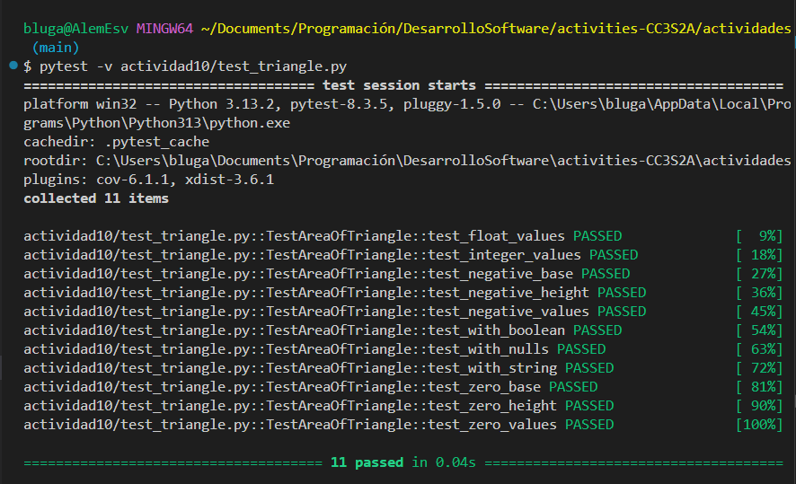
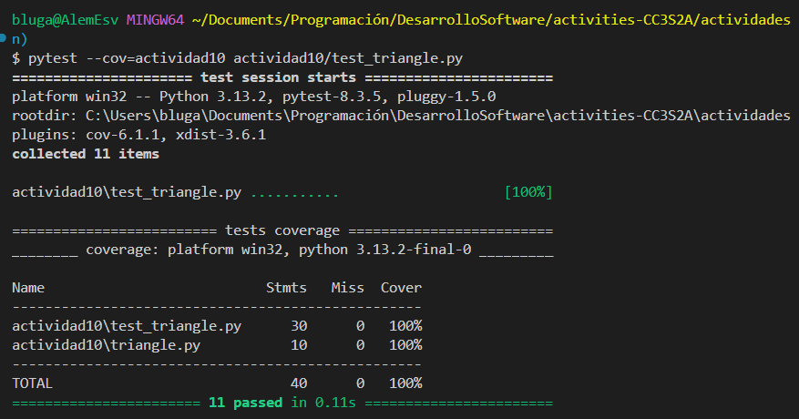
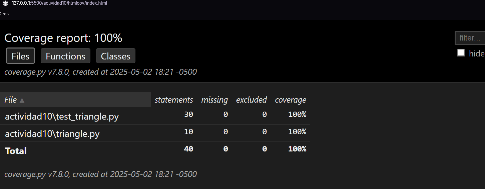
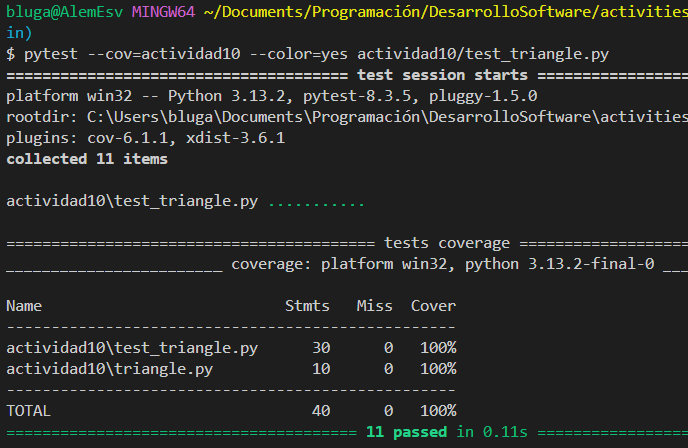
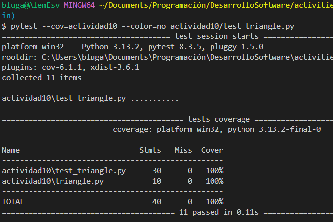
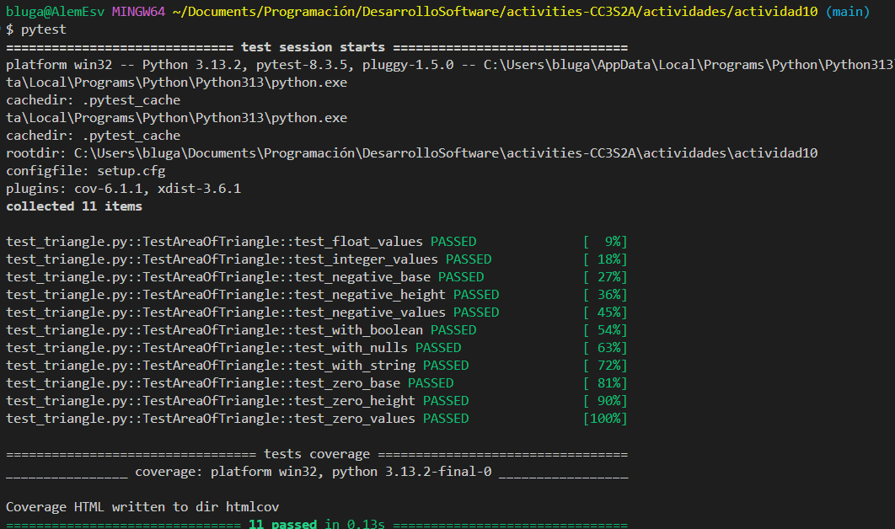

## Actividad: Ejecutar pruebas con pytest

# Pytest
Framework de realización de pruebas de software en `Python`. Facilita la escritura de pruebas, tanto unitarias como funcionales, y ofrece características avanzadas como descubrimiento automático de pruebas, pruebas parametrizadas y soporte para plugins

## Features
- **Información detallada sobre los errores en las afirmaciones** (assert), sin necesidad de recordar los nombres específicos como self.assert*, lo que simplifica la escritura y el diagnóstico de pruebas fallidas.
- **Descubrimiento automático de módulos y funciones de prueba**, lo que permite ejecutar tests sin tener que registrarlos manualmente.
- **Fixtures modulares**, ideales para gestionar recursos de prueba reutilizables o parametrizados, ya sea en pruebas pequeñas o de larga duración.
- **Compatibilidad directa con pruebas escritas en unittest**, por lo que puedes integrar fácilmente pruebas existentes sin necesidad de reescribirlas.
- Compatible con **Python 3.8+** y **PyPy 3**.
- **Arquitectura de plugins robusta**, con más de 1300 plugins externos disponibles y una comunidad activa que continúa ampliando sus capacidades.

### 1. Instalando `pytest`:
```
pip install -U pytest
# versión instalada
pytest --version
```
A diferencia de `unittest`, no requiere que definas clases ni métodos especiales como `setUp` o `tearDown`; en su lugar, puedes escribir funciones simples cuyo nombre comience con `test_`. Esto hace que la sintaxis sea más intuitiva y directa, permitiendo centrarse en la lógica de la prueba sin la sobrecarga de una estructura formal.
```
# Ejecución de pruebas detalladas(-v)
pytest -v
```


### 2. Añadir cobertura de pruebas
Es fundamental conocer qué porcentaje del código fuente está siendo ejecutado durante las pruebas, ya que esto nos ayuda a identificar posibles partes no testeadas o vulnerables. Para medir esta cobertura de código, se utiliza el complemento `pytest-cov`, una extensión de `pytest` que integra la herramienta `coverage.py`.
En mi caso, mi proyecto tiene la siguiente estructura:
```
actividades
.
|-- actividad10
    .
    |-- setup.cfg
    |-- test_triangle.py
    `-- triangle.py
pytest --cov=actividad10
```

Este comando ejecutará los tests en `test_triangle.py` y medirá la cobertura del archivo `triangle.py`, generando un informe de cobertura de todo el paquete `pruebas_pytest`.
Si se desea agregar informes en HTML para visualizarlo, se puede usar el siguiente comando:
```
pytest --cov=actividad10 --cov-report=html
```


### 3. Añadiendo color
`pytest` incluye por defecto un sistema de resaltado de colores en su salida por consola, lo que facilita la lectura e interpretación de los resultados de las pruebas sin necesidad de instalar plugins adicionales. Los colores están diseñados para ofrecer una retroalimentación visual inmediata: las pruebas que se ejecutan correctamente se muestran en verde, mientras que las que fallan o presentan errores aparecen en rojo.
a) con color



b) sin color



## Automatización de la configuración: 
### setup.cfg
`setup.cfg` es un archivo de configuración centralizado que permite definir ajustes para todo el paquete o proyecto en Python. Su principal objetivo es unificar la configuración de múltiples herramientas en un solo lugar, evitando la dispersión de archivos individuales para cada herramienta.
Este archivo utiliza una estructura basada en secciones, cada una identificada por encabezados como `[tool:pytest]`, `[flake8]`, `[mypy]` o [coverage:report]`, dependiendo de la herramienta que se esté configurando.

### pytest.ini
Es un archivo de configuración específico para pytest. Solo contiene configuraciones que pytest usa directamente.
Si quieres configurar solo pytest sin agregar configuraciones de otras herramientas o mantener la configuración más organizada para esta herramienta en particular, pytest.ini es una opción preferida.
```
[tool:pytest]
addopts = -v --tb=short --cov=. --cov-report=term-missing

[coverage:run]
branch = True

[coverage:report]
show_missing = True
```


