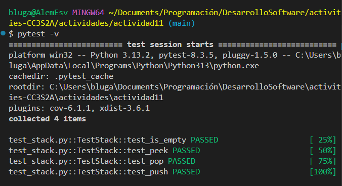
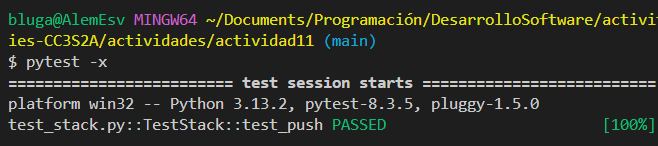
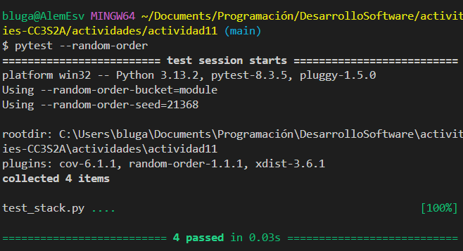
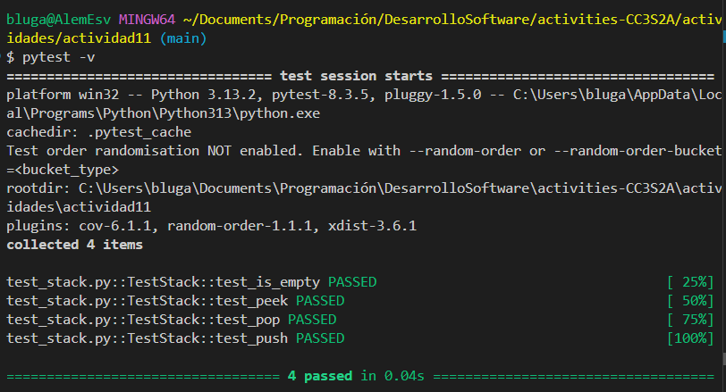
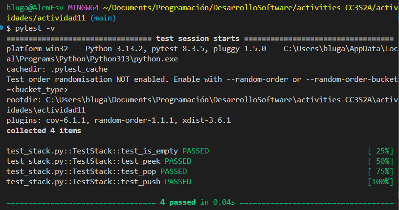
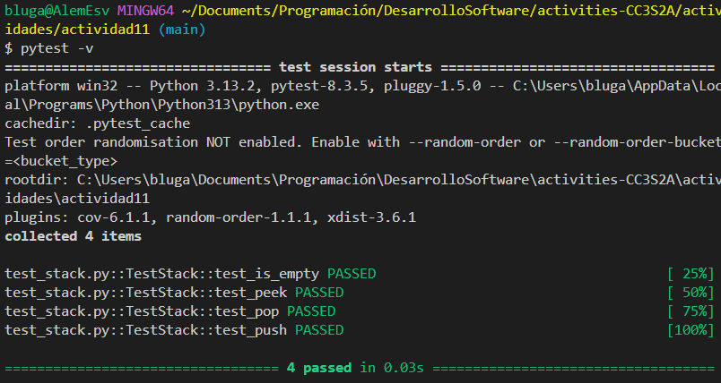
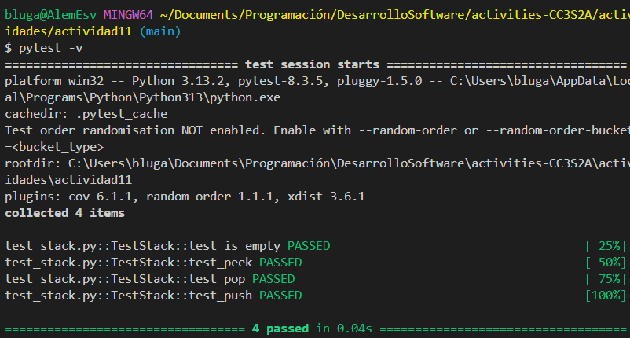
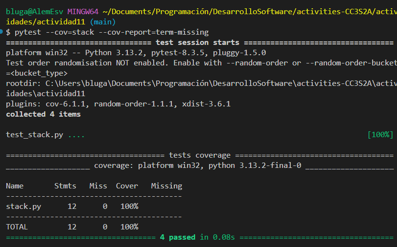

## Actividad: Escribir aserciones en pruebas con pytest

### 1. Archivo de prueba
a) `stack.py`
```python
class Stack:
    def __init__(self) -> None:
        self.items = []
    def push(self, data: Any) -> None:
        self.items.append(data)
    def pop(self) -> Any:
        return self.items.pop()
    def peek(self) -> Any:
        return self.items[-1]
    def is_empty(self) -> bool:
        return len(self.items) == 0
```
Se verifica que al inicio las pruebas pasan con pytest:
```
pytest -v
```

Prueba de ejecución con el primer fallo:
```
pytest -x
```

Para ejecutar pruebas en orden aleatorio, pytest ofrece un plugin llamado pytest-randomly, que permite que las pruebas se ejecuten en un orden aleatorio o pseudoaleatorio, garantizando que los casos de prueba no dependan del orden de ejecución.
```
# primero se instala el plugin
pip install -pytest-random-order
pytest --random-order
```

### 2. Aserciones
a) Asersiones para el método `is_empty()` y `test_pop()`
Modificaciones a ambos métodos:
```python
# test: verifica si está vacio
def test_is_empty(self):
    stack = Stack()
    assert stack.is_empty() == True
    stack.push(5)
    assert stack.is_empty() == False
# test: eliminar un elemento de la pila.
def test_pop(self):
    self.stack.push(3)
    self.stack.push(5)
    self.assertEqual(self.stack.pop(), 5)
    self.assertEqual(self.stack.peek(), 3)
    self.stack.pop()
    self.assertTrue(self.stack.is_empty())   
```

b) Asersiones para el método `test_peek()`
Modificación al método:
```python
def test_peek():
    stack = Stack()
    stack.push(1)
    stack.push(2)
    assert stack.peek() == 2
    assert stack.peek() == 2 
```

Comprobación con otro tipo de prueba en `pytest`:
```python
def test_peek(self):
    self.stack.push(3)
    self.stack.push(5)
    self.assertEqual(self.stack.peek(), 5)
```

c) Asersiones para el método `test_push()`
```python
def test_push():
    stack = Stack()
    stack.push(1)
    assert stack.peek() == 1
    stack.push(2)
    assert stack.peek() == 2
```

```python
def test_push(self):
    self.stack.push(3)
    self.assertEqual(self.stack.peek(), 3)
    self.stack.push(5)
    self.assertEqual(self.stack.peek(), 5)
```

### 3. Pruebas con cobertura
Para asegurar que las pruebas cubran suficiente código, se genera un informe de cobertura utilizando pytest-cov.
```
pytest --cov=actividad11 --cov-report=term-missing
```

### 4. Archivo de configuración
Este es un archivo de configuración para pytest y coverage, que personaliza cómo se ejecutan las pruebas y cómo se recopila el informe de cobertura de código.
```bash
[tool:pytest]
addopts = -v --tb=short --cov=stack --cov-report=term-missing

[coverage:run]
branch = True
omit =
    */tests/*
    */test_*

[coverage:report]
show_missing = True
```
