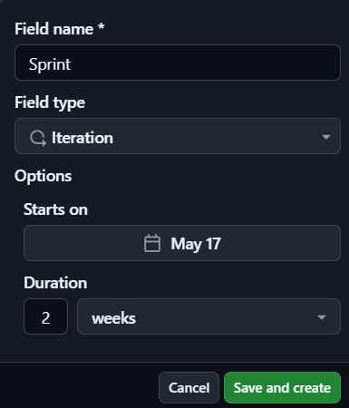
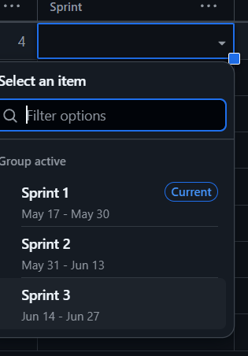
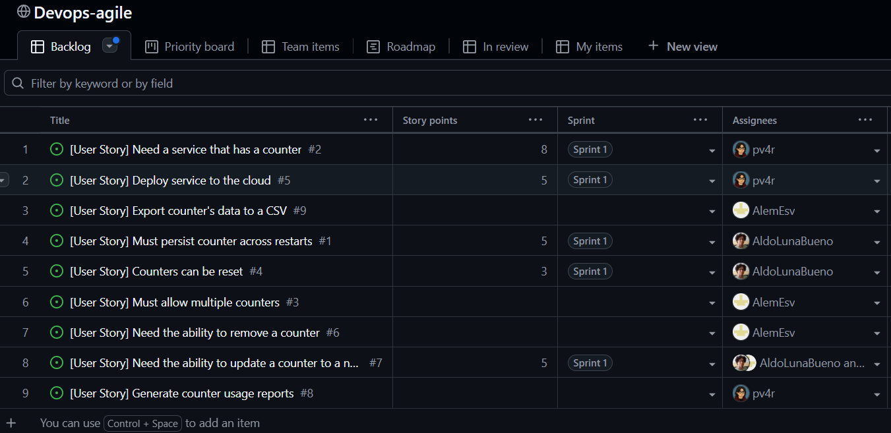
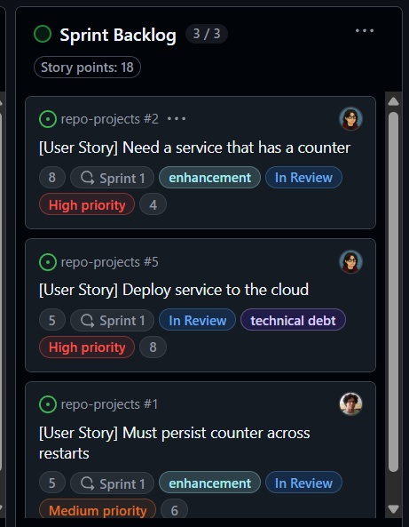
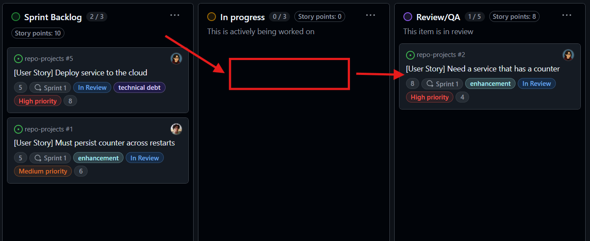
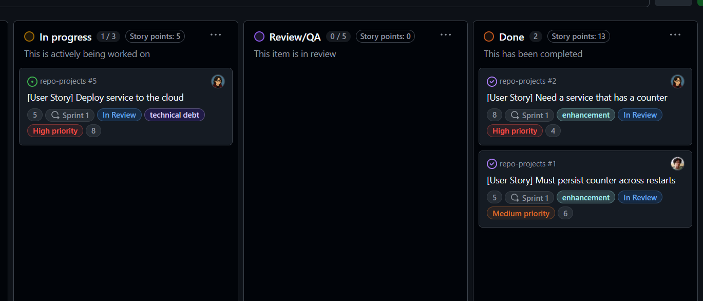

# Actividad: Gestión ágil de sprints con GitHub, planificación, ejecución y cierre de Sprints

Ver el proyecto aquí: [Proyecto Grupal act 17 - 18](https://github.com/AlemEsv/repo-projects)

## Configuración de Sprints

GitHub configurará tres sprints de forma predeterminada para empezar. Luego, creará nuevos sprints automáticamente según sea necesario.

Sprint plan:

Asignaremos puntos de historia estimados y un sprint

y moveremos las historias del Product Backlog al Sprint Backlog para construir nuestro plan.

Simulación de flujo de trabajo diario:

Se moverán historias desde la parte superior del Sprint Backlog a la columna In Progress, como se muestra a continuación.

Al finalizar las revisiones en Q/A, veremos como el backlog Kanba habrá cambiado.

## Configuración del Burndown Chart

- Hacer click en el menú desplegable junto a `Backlog` y seleccionar `Generate Chart`

    

- Nos redirige a `Insights` donde vemos un gráfico predeterminado para el proyecto

    

- Para mostrar el estado de las historias en la columna `Done` en lugar del gráfico predeterminado, se aplica un filtro.

    

- Configuramos el gráfico

    

- Para centrar el gráfico en un sprint específico, usamos la opción de filtro. Escribimos **sprint:** en el cuadro de filtro y seleccionamos el sprint como **Sprint 1**

    

## Gestionar el trabajo incompleto

- Seleccionamos la historia **Deploy service to the cloud** en la columna In Progress para abrirla.

    

- Hacemos clic en la opción **Estimate**.

    

- El desarrollador ha determinado que no se gastaron 5 story points de esfuerzo en esta historia y simplemente se quedaron sin tiempo. Estiman que se gastaron 2 story points. Introducimos **2** en el campo de texto para cambiar los story points. Ahora podemos ver que los story points están configurados en 2.

    

- Ahora los story points se han ajustado para reflejar el esfuerzo que se hizo en este sprint. Movemos esta historia a la columna **Done**.

    

- Se necesita crear una nueva historia para documentar el trabajo restante. Completamos el nuevo issue llenando el título y la descripción para completar la historia. Asignamos la etiqueta **technical debt**, similar a la historia original. Elegimos el proyecto como **Devops-agile**.

    

- Dado que este nuevo issue se agregará a la columna Product Backlog, abrimos la lista desplegable junto a la opción **Status** y elegimos **Product Backlog**. Establecemos el **Estimate** en **3**, representando los story points restantes de la historia no terminada.

    

    

- Aseguramos de que la historia esté en la parte superior de la columna Product Backlog para ser seleccionada en el próximo sprint.

    Aquí necesitamos agregar la etiqueta de prioridad `High priority` debido a que las columnas están ordenadas bajo ese criterio.

    
