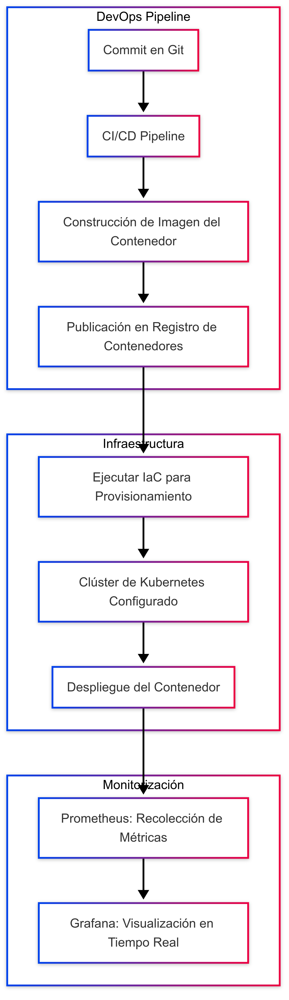

# Del código a la producción: Infraestructura, contenedores, despliegue y observabilidad
## 1. Contenedores
Los contenedores son entornos ligeros y portables que encapsulan todo lo necesario para ejecutar una aplicación: código, librerías, variables de entorno, archivos de configuración y herramientas del sistema. Permiten aislar las cargas de trabajo, lo que mejora la portabilidad, escalabilidad y seguridad del software.
### Problemas de seguridad
- Attack surfaces: al compartir el mismo kernel del sistema operativo, un contenedor comprometido podría ser explotado para afectar a otros contenedores.
- Herramientas de orquestación: Vulnerabilidades o una mala configuración en herramientas como Docker o Kubernetes pueden facilitar accesos no autorizados a los contenedores.
## 2. Kubernetes
Kubernetes es una plataforma de orquestación de contenedores que automatiza el despliegue, escalado y gestión de aplicaciones en contenedores.
### Secretos y manejo de configuraciones
Kubernetes te deja guardar y manejar información sensible como Oauth tokens y llaves SSH. El control de secretos por medio de kubernets te permite actualizar y aplicar secretos sin necesidad de hacer un rebuilding a los contenedores de imágenes.
### Qué no es K8s
Kubernetes no es un PaaS (Platform as a Service) tradicional. Aunque proporciona funcionalidades comunes de los PaaS —como balanceo de carga, escalado automático y despliegues continuos—, lo hace de forma modular. Esto le otorga mayor flexibilidad y control al usuario sobre la infraestructura subyacente.
## 3. Observabilidad
Es la capacidad de comprender el estado interno de un sistema a partir de la información que genera externamente, como logs y métricas. Es esencial para el monitoreo efectivo, la detección de problemas y la mejora continua en sistemas distribuidos y complejos.
## 4. Time-to-market
Gracias al uso de pipelines CI/CD podemos reducir significativamente este "time-to-market", ya que se comienza a automatizar procesos dentro del ciclo build, test y deployment. Esto da un aceleramiento en el feedback por ciclo que se da dentro del ambiente del desarrollo de software, dando pasos más solidos hacia una mayor robustez en el código.
Además se da uso a herramientas de seguridad integradas en el proceso CI/CD, como el usio de testeos por medio de algoritmos de machine learning para encontrar la mayor cantidad de errores en el código en tan poco tiempo. Asi que para una empresa es muy necesario hacer uso de herramientas de CI/CD así agilizan el tiempo de mercado de sus productos de software.
## 5. Empresas y el uso de herramientas para el control de altos volúmenes de tráfico de datos  
Tenemos varios casos de herramientas que manejen dichos desafíos como:
- Netflix:
Hace uso de balanceadores de carga elásticos (ELB) para distribuir mejor su tráfico entre zonas, además de tener bases de datos descentralizadas para poder tener mayor seguridad por si hay alguna caída en los almacenes de sus computadores, y así reducir errores por la cantidad de datos almacenados que tienen.
- Spotify: 
Hace uso de Kubernetes como software para la gestión de la orquestación de contenedores en su infraestructura de microservicios.
- Uber: 
Maneja grandes volúmenes de datos utilizando softwares como apache Kafka para poder transmitir eventos de forma más eficiente, y Cassandra para el manejo de sus datos.
## 6. pipelines CI/CD
Es un conjunto de prácticas esenciales para acelerar y asegurar la entrega de software en entornos modernos de desarrollo ágil.
### Integración Continua (CI)
La Integración Continua consiste en fusionar con frecuencia los cambios realizados por los desarrolladores en un repositorio compartido, generalmente varias veces al día. Cada integración es verificada automáticamente mediante pruebas automatizadas y análisis de calidad.
### Entrega y Despliegue Continuos (CD)
- Entrega Continua: Garantiza que cada cambio que pasa las pruebas pueda ser desplegado en producción en cualquier momento, de forma controlada y automatizada.
- Despliegue Continuo: Libera automáticamente los cambios a producción tras superar todas las etapas de prueba.
## 7. Flujo teórico

