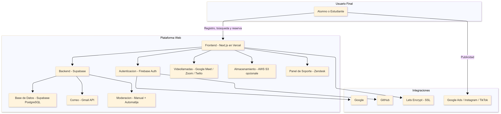

# Actividad 3
# 1. Motivaciones para la nube

#### a. ¿Qué problemas o limitaciones existían antes del surgimiento de la computación en la nube y cómo los solucionó la centralización de servidores en data centers?

Los problemas principales de las empresas eran los grandes costos para tener hardware físico necesario para sus proyectos, esto escapaba de empresas medianas o pequeñas, ya que no se podían permitir tener una infraestructura robusta y consistente. Además no había un escalado de recursos flexible y rápidamente adaptable a las necesidades cambiantes de los negocias gracias a la gran cantidad de dinero que conllevaba hacer cambios.

Para esto la nube vino a encontrar una solución mediante la centralización de servidores que puedan ser accedidos por diferentes usuarios mediante el internet, teniendo un costo por el servicio sin necesidad de tener la infraestructura de manera física, pudiendo configurarla a la necesidad de la empresa y poder dar una reducción en costos.

#### b. ¿Por qué se habla de “The Power Wall” y cómo influyó la aparición de procesadores multi-core en la evolución hacia la nube?

Power Wall es llamado a la barrera física y técnica que limitaba el rendimiento de los procesadores de aquellas epocas. Se trató de contrarrestar aumentando la frecuencia de reloj para así poder mejorar el rendimiento de las CPU pero generaba un consumo excesivo de energía, calor y una limitación en la eficiencia llegando a cierto punto.

Esto provocó a la aparición de procesadores de nucleos múltiples, los cuales aumentaban el rendimiento del CPU sin necesidad de un incremento de frecuencia de reloj permitiendo el crecimiento exponencial de la **computación en la nube** al proporcionar mayor eficiencia y escalabilidad.
## 2. Clusters y load balancing
#### a. Explica cómo la necesidad de atender grandes volúmenes de tráfico en sitios web condujo a la adopción de clústeres y balanceadores de carga.
A medida que los sitios web crecieron en popularidad y tráfico, surgió la necesidad de infraestructuras más robustas para garantizar disponibilidad, rendimiento y escalabilidad. Esto llevó a la adopción de **clústeres** de servidores y **balanceadores de carga**, que permiten distribuir el tráfico de manera eficiente.

Cuando un sitio web recibe un alto número de solicitudes, un solo servidor puede convertirse en un cuello de botella. Algunas de las limitaciones incluyen:
- **Capacidad limitada de procesamiento y memoria**.
- **Mayor tiempo de respuesta** debido a la sobrecarga.
- **Fallas en la disponibilidad** si el servidor se cae o experimenta problemas.

#### b. Describe un ejemplo práctico de cómo un desarrollador de software puede beneficiarse del uso de load balancers para una aplicación web.
Imaginemos que un desarrollador está construyendo una aplicación web para una tienda en línea. A medida que el sitio crece en popularidad, miles de usuarios intentan acceder simultáneamente, generando una carga pesada en el servidor.

## Problema sin Balanceador de Carga
- Un único servidor puede saturarse rápidamente, afectando el rendimiento y aumentando los tiempos de respuesta.
- Si el servidor falla, la tienda en línea deja de estar disponible, lo que afecta las ventas y la experiencia del usuario.

## Solución con Balanceador de Carga

- Se implementa un **balanceador de carga** que distribuye las solicitudes entre varios servidores.
- Si un servidor falla, el balanceador redirige el tráfico automáticamente a los servidores activos, asegurando la disponibilidad del servicio.
- Se pueden agregar nuevos servidores al clúster según la demanda, mejorando la escalabilidad.
## Beneficios

- **Mejor rendimiento**: La carga se distribuye, evitando que un solo servidor se sobrecargue.
- **Alta disponibilidad**: La aplicación sigue funcionando incluso si uno o más servidores fallan.
- **Escalabilidad**: Se pueden agregar más servidores sin interrumpir el servicio.

# 3. Elastic computing

#### a. Define el concepto de Elastic Computing.

Es la capacidad que tiene la nube para poder gestionar sus recursos informáticos para situaciones donde haya un uso máximo de los recursos sin necesidad de planeamientos previos.

#### b. ¿Por qué la virtualización es una pieza clave para la elasticidad en la nube?

la virtualización es una herramienta que permite hacer la gestión de recursos sin necesidad de depender de un hardware físico, por lo que es una parte crucial, sin la virtualización se tendría que esperar y verificar el estado de los componentes físicos de la infraestructura de nuestro software.

#### c. Menciona un escenario donde, desde la perspectiva de desarrollo, sería muy difícil escalar la infraestructura sin un entorno elástico.

# 4. Modelos de servicio(IaaS, PaaS, AaaS, DaaS)
#### a. Diferencia cada uno de estos modelos. ¿En qué casos un desarrollador optaría por PaaS en lugar de IaaS?

- **IaaS:** El usuario puede gestionar el SO y sus aplicaciones.
- **PaaS**: El usuario solo puede hacer uso de las aplicaciones dentro de la infraestructura del proveedor de la nube.
- **AaaS:** El usuario solo es capaz de visualizar y analizar datos dentro de una aplicación en la nube.
- **DaaS:** El usuario solo puede acceder a los escritorios remotos.

Un desarrollador va optar por un PaaS cuando solo quiera hacer uso de las herramientas que proporciona una plataforma, sin necesidad de tener control sobre la administración de servidores, configuraciones de la red o el manejo del SO propuesto.

#### b. Enumera tres ejemplos concretos de proveedores o herramientas que correspondan a cada tipo de servicio.

| Servicio | Proveedor 1       | Proveedor 2           | Proveedor 3           |
| -------- | ----------------- | --------------------- | --------------------- |
| IaaS     | Amazon EC2        | Google Compute Engine | Azure Virtual Machine |
| PaaS     | Google App Engine | Heroku                | Azure App Service     |
| AaaS     | Google BigQuery   | AWS QuickSight        | Microsoft Power BI    |
| DaaS     | Amazon WorkSpaces | Azure Virtual Desktop | Citrix VIrtual Apps   |

# 5. Tipos de nubes
### a. ¿Cuáles son las ventajas de implementar una nube privada para una organización grande?
Las nubes privadas implementan un mejor control, seguridad y personalización a las nubes, a comparación de una nube pública donde no puedes tener un control total de lo que tienes subido en la nube.
La seguridad también es otro punto clave, donde puedes aislar recursos, tener brechas de datos más pequeñas gracias a la privatización de varios recursos.
#### b. ¿Por qué una empresa podría verse afectada por el “provider lock-in”?
El "provider lock-in" pasa cuando una empresa solo confia en un proveedor de servicios en la nube. Esto puede ocasionar en que mientras más tiempo pase más costoso será intentar migrar parte de los servicios a diferentes nubes por X o Y motivo, en dado caso pase la migración de datos puede existir una perdida de datos dependiende de la cantidad de datos almacenados en esa única nube. Nuevas tecnologías han sido diseñadas para prevenir a una empresa a esto, y así no ocasionar perdidas innecesarias de datos y dinero.
### c. ¿Qué rol juegan los “hyperscalers” en el ecosistema de la nube?

# Estudio de casos

# 1. Empresas que migraron a la nube
### a. Coca-cola:
Coca cola consideró una migración a la nube en el año 2013 debido a la saturación en sus servidores luego de hacer un anuncio en la Super Bowl del 2013, por lo que inició su migración a una nube AWS. 
Deste aquel momento, la empresa ha tenido una reducción en costos operativos de alrededor un 40%, y el volumen de tickets de TI en un 80%.
Por lo que esta migración ha supuesto una mejora a los servicios ofrecidos por Coca-cola para las nuevas generaciones.

### b. Netflix:
A raíz de los problemas con los envíos de DVDs en su plataforma digital, por el 2008 Netflix tomó la decisión de dar un salto a la nube, una transición que le costó 7 años.
La elección de nube que escogieron fue AWS como proveedor principal en su trayectoria para la transición, por 2015 ya tenían migrado la mayoría de sus sistemas, en conjunto con sus servicios al cliente. Este proceso fue largo y muy premeditado para que ningun dato sea perdido, explican eso como uno de los retos más dificiles de la migración.
en 2016, ya con la migración completada, vieron como el número de suscriptores a su plataforma de streaming comenzaba a multiplicarse de forma exponencial.
Netflix ha seguido evolucionando a toda velocidad, incorporó muchas funciones nuevas que necesitaron de gran cantidad de recursos, y recurriendo a volúmenes de datos cada vez mayores.

# Comparativa de Modelos de servicio (PaaS, IaaS, SaaS)

| **Aspecto**                 | **IaaS**                                       | **PaaS**                                        | **SaaS**                                       |
|----------------------------|------------------------------------------------|------------------------------------------------|-----------------------------------------------|
| **Mantenimiento del S.O.** | Usuario (Operaciones/DevOps)                  | Proveedor                                      | Proveedor                                     |
| **Despliegue de aplicaciones** | Desarrollador / Operaciones                 | Desarrollador                                  | Proveedor                                     |
| **Gestión de la red**      | Usuario (Operaciones/DevOps)                  | Proveedor                                      | Proveedor                                     |
| **Escalado automático**    | Usuario configura, proveedor provee infra     | Proveedor (configurable por el usuario)        | Proveedor                                     |
| **Escalabilidad**          | Manual / automatizable por el usuario         | Gestionada por el proveedor (autoescalado)     | Transparente para el usuario                  |

## Nube Pública
- **Costos**: OPEX. Sin grandes inversiones iniciales.
- **Flexibilidad**: Muy alta. Escalabilidad casi inmediata.
- **Cumplimiento**: Puede ser complejo si no se elige bien el proveedor.
- **Cambio de proveedor**: Difícil por dependencia de servicios propietarios.

## Nube Privada
- **Costos**: CAPEX alto. Requiere hardware propio o dedicado.
- **Flexibilidad**: Limitada por la infraestructura instalada.
- **Cumplimiento**: Alta, más fácil controlar datos y procesos.
- **Cambio de proveedor**: Bajo impacto, si es on-premise.

## Nube Híbrida
- **Costos**: Combinación de CAPEX y OPEX.
- **Flexibilidad**: Buena, se aprovecha lo mejor de ambos mundos.
- **Cumplimiento**: Alta, datos sensibles en nube privada.
- **Cambio de proveedor**: Complejo por la integración entre nubes.

## Multi-cloud
- **Costos**: OPEX. Posiblemente más alto por duplicidad de servicios.
- **Flexibilidad**: Excelente. Se evita la dependencia de un solo proveedor.
- **Cumplimiento**: Alto, si se elige cada proveedor por fortaleza específica.
- **Cambio de proveedor**: Menor impacto, ya hay experiencia multilateral.

# Ejercicio de presentación de "mini-proyecto"

Como parte del *aprendizaje práctico, forma equipos y presenten un **"Mini-proyecto de arquitectura en la nube"*:

## 1. Objetivo del sistema:
Se desarrollara una página web que conecta a usuarios (alumnos o estudiantes preuniversitarios) con alumnos universitarios o egresados para recibir una orientacion vocacional. Los usuarios podran registrarse, buscar carreras disponibles, reservar sesiones virtuales, recibir automaticamente una reunion agendada por correo con un enlace de una plataforma de videollamadas, y calificar el servicio recibido

## 2. Selección de modelo de servicio:
Se elegiria PaaS ya que solamente necesito enfocarme en el desarrollo de la pagina web, no de la infrastructura, ademas que me permite desplegar mi web y backend de forma sencilla. Tambien se utilizaria SaaS, ya que se integrara servicios como google meet o Zoom, ademas del Gmail API para el envio automatico de correos.

## 3. Tipo de nube:
Haremos uso de una nube pública, ya que nos brinda recursos (servidores, almacenamiento, etc.) ya gestionados por el proveedor externo, por lo que se nos hace más sencillo trabajar desde ese tipo de nube.
### El proyecto necesita:
- Alta disponibilidad, para que los estudiantes puedan entrar en cualquier
momento.
- Bajos costos, ya que al ser un proyecto pequeño no se contará con un
presupuesto alto.
- Escalabilidad automática para su adaptación dependiendo de la cantidad de
usuarios.
- Mantenimientos mínimos de los servidores, ya que el grupo debe enfocarse en la
lógica del sistema.
### Opciones:
- Heroku: Ideal para novatos y si es que se quiere publicar rápido una API o app
sencilla. Muy amigable.
- Vercel: Perfecto para interfaces en React/Next.js. Es rápido y no se dificulta.
- Supabase: Se usa si se busca un backend robusto con una base de datos real.
Perfecto para apps con un sistema de usuarios.
- Firebase: Perfecto para aplicaciones donde se necesita tiempo real, como chats o
dashboards colaborativos. Tiene todo incluido para frontend y apps móviles.
- Render: Parecido a Heroku, pero nos brinda más control.
### Recomendación:
- Frontend: Vercel + Next.js
- Backend: Supabase, funciones integradas
- Chat/Reuniones: Firebase
- Base de datos: Supabase
- Despliegue: Vercel + Supabase
## 4. Esquema de escalabilidad:
Según las recomendaciones, ya estamos usando servicios en la nube (Vercel, Supabasem
Firebase), ya que se ajustan automáticamente dependiendo de la demanda.

- Vercel: escala automáticamente, si el tráfico es demasiado alto, se puede optar
por planes de pago que nos ayuden.

- Supabase (backend): escala automáticamente, separa funciones críticas y mejora
la eficiencia de las consultas.

- Supabase (base de datos): Escala verticalmente.

- Firebase: Escala sin esfuerzo, si el tráfico es bastante, es recomendable pasar a
Firestore o usar reglas de seguridad eficientes.

- Supabase (autenticación): Se maneja sin complicaciones. Si la demanda es
demasiada, se puede usar proveedores externos, como Google o GitHub, para
balancear cargas.

## 5. Costos (directos o indirectos) y riesgos asociados

### Costos Directos

- **Hosting en la nube:** Se podría usar **Amazon Web Services (AWS)** para alojar la aplicación. Esto incluye EC2 para servidores, RDS para bases de datos y S3 para almacenamiento de archivos.

- **Videollamadas:** Se puede integrar **Twilio Video**, que cobra aproximadamente $0.004 por minuto por participante. Es estable, confiable y permite integración sencilla con la web.

- **Certificados SSL:** Con **Let’s Encrypt** se puede obtener certificados SSL gratuitos, con posibilidad de migrar a certificados de pago si se requieren garantías adicionales.

- **Autenticación:** Con **Firebase Authentication**, base de datos gratuito que permite autenticación con correo, Google, entre otros.

### Costos Indirectos

- **Marketing y adquisición de usuarios:** Habrá inversión en campañas de **Google Ads** y promoción en redes sociales como **Instagram y TikTok**.

- **Soporte técnico:** Se contratará personal para resolver dudas de alumnos y universitarios vía **Zendesk** o correo electrónico.

- **Capacitación a mentores:** Se desarrollarán materiales como videos y guías para los mentores, en conjunto con talleres virtuales via **Google Meet**. El costo será variable, dependiendo del alcance.

- **Moderación de contenido:** Se implementará un sistema de revisión manual y automático de perfiles y calificaciones.

### Riesgos Asociados

- **Poca adopción inicial:** Si no logramos atraer a suficientes usuarios, la plataforma podría parecer vacía y desincentivar su uso. Por lo que se tratará de mitigar con campañas agresivas de difusión y posibles alianzas con diferentes colegios.

- **Malas experiencias:** Un universitario puede dar una mala charla o tener un comportamiento inapropiado, por eso se tiene un sistema de reporte y moderación activa, con posibilidad de expulsión inmediata.

- **Sobrecarga de infraestructura:** Si la plataforma recibe muchos usuarios de golpe, los servidores podrían colapsar. Para evitar esto, se podría hacer un **autoscaling** en AWS y realizar pruebas de carga periódicas.

## 6. Diagrama visualizador

