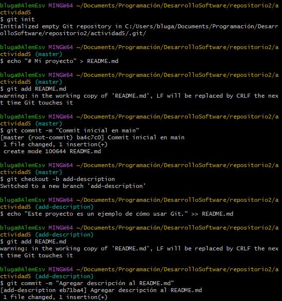
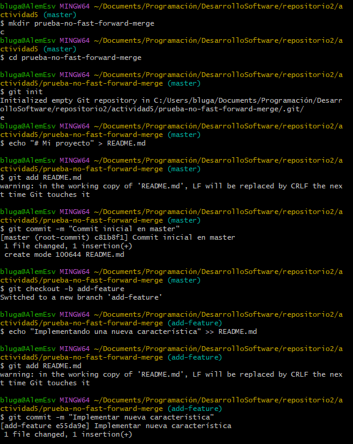
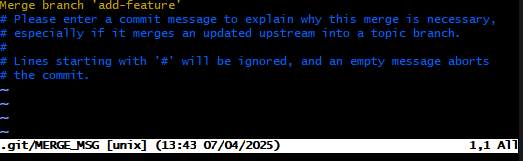
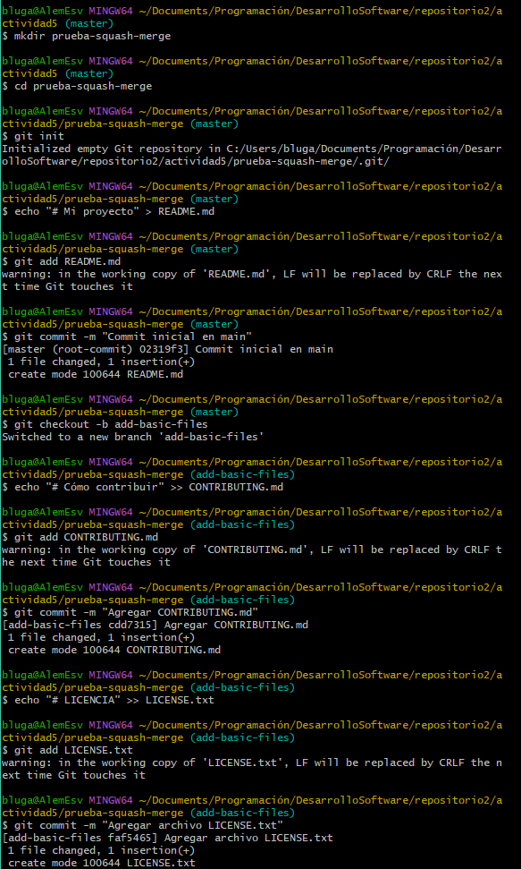
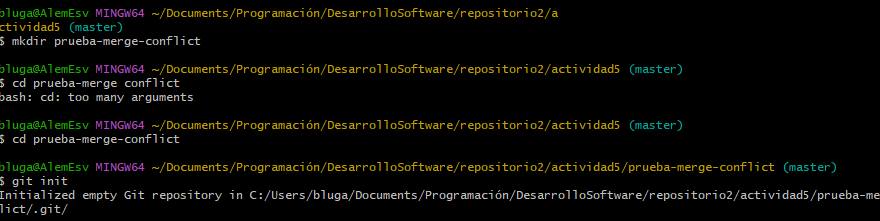
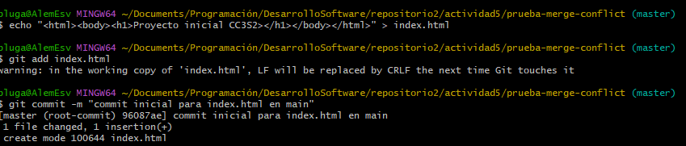
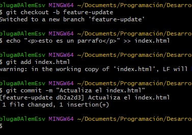
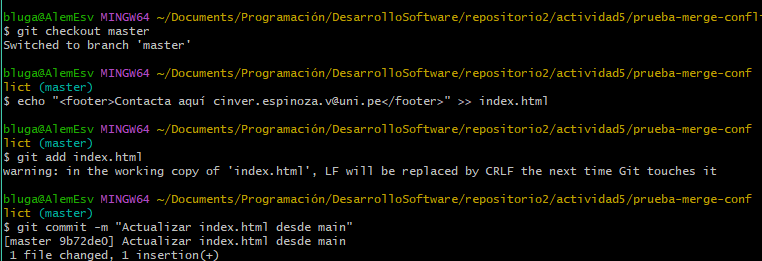
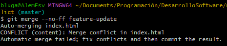
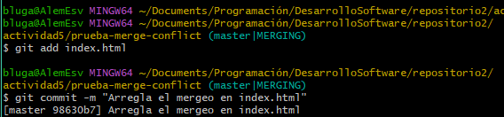

# Explorando diferentes formas de fusionar en Git
# Fusión Fast-forward

### a. Pasos prácticos: 

### b. Mostrar la estructura de commits resultante

# Fusión No-Fast-forward

### a. Pasos prácticos

### b. Muestra el log de commits resultante

# Fusión squash

### a. Pasos prácticos

### b. ¿Cuál es la estructura de commits?

# Ejercicios
### 1. Resolver conflictos en una fusión non-fast-forward

#### a. Inicializar el repositorio

#### b. Crea archivo index.html y hacer el commit de este en main

#### c. Cambio de rama y actualización a index.html

#### d. Regreso a la rama main y actualizo desde ahí a index.html

#### e. Fusión de la rama feature-update con --no-ff

#### f. Al intentar hacer la fusión habrá un conflicto, asi que toca actualizar index.html.

#### g. Una vez se arregla el conflicto se guarda y se termina el mergeo.

#### h. Revisión en el historial.

### Preguntas 1
#### ¿Qué pasos adicionales tuviste que tomar para resolver el conflicto?
Entré con ayuda de nano al "index.html" para resolver el conflicto, vi que habían 2 versiones distintas para el mismo archivo asi que intenté acoplar las dos versiones en un mismo "index.html", borrando los "==== " y las cabeceras "HEAD" y "feature-update" en ambos casos.

#### ¿Qué estrategias podrías emplear para evitar conflictos en futuros desarrollos?
Para futuros trabajos se puede emplear squash para el caso de añadir código nuevo al "index.html", ya que solo se colocaría en una línea de texto posterior a la que ya se tiene inicialmente, por lo que no existirían problemas de mergeo

