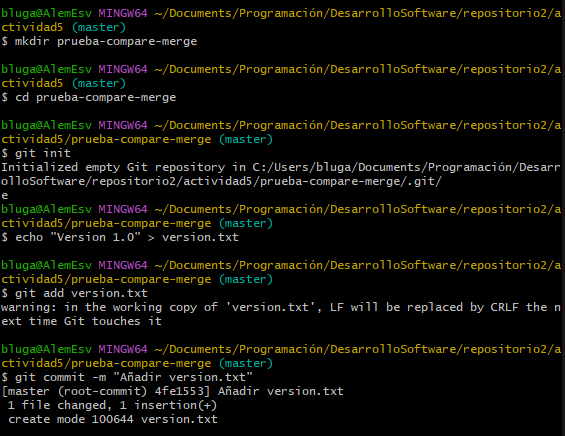
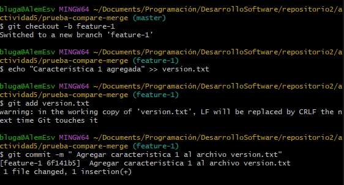
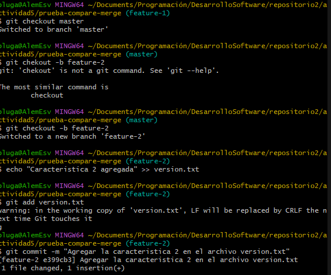
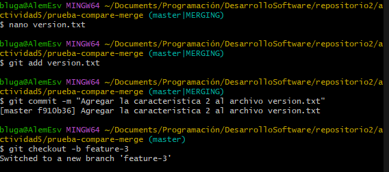
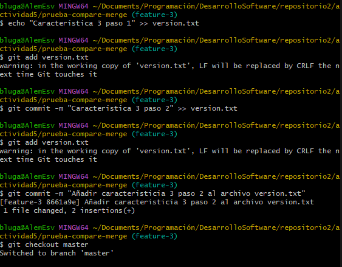
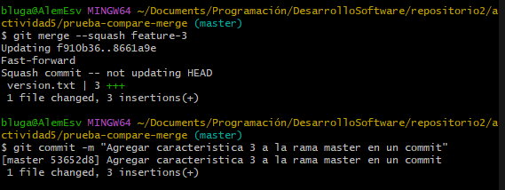
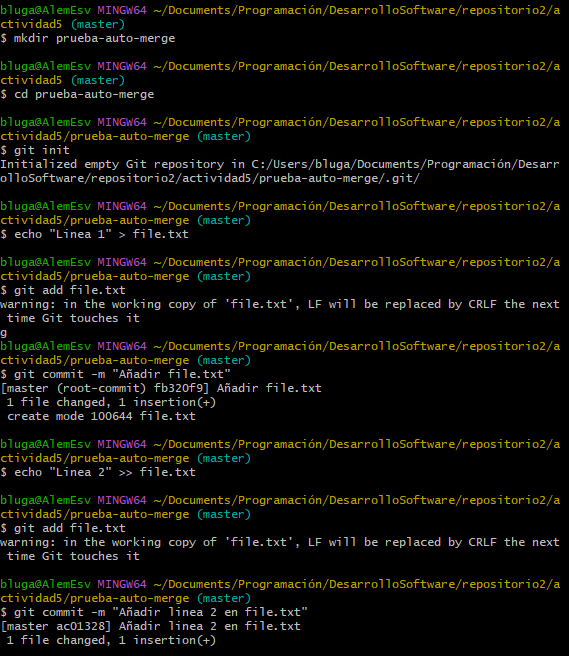
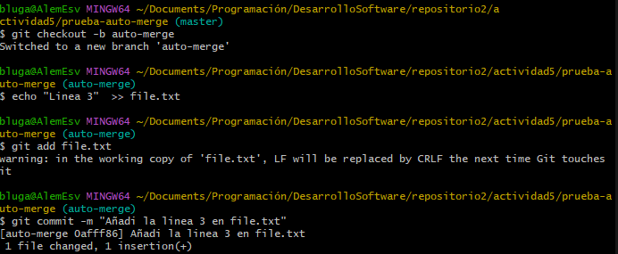
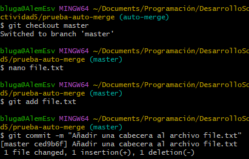
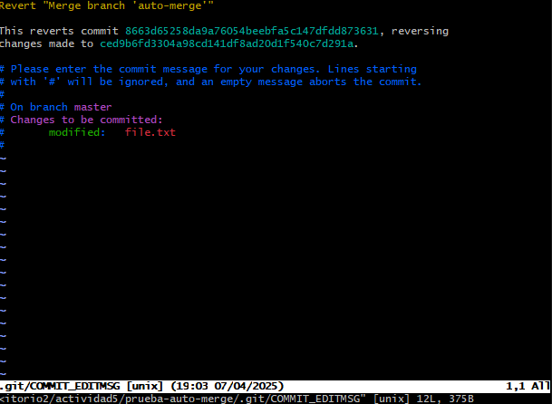

# Explorando diferentes formas de fusionar en Git
### **Objetivo de aprendizaje:**  
En esta actividad, exploraremos el proceso de fusionar dos ramas en Git utilizando tres métodos diferentes: fast-forward, no-fast-forward y squash. A través de los ejemplos, comprenderás cómo funcionan y cuándo es recomendable utilizar cada tipo de fusión.
#### Contexto
En el mundo del desarrollo de software, Git se ha consolidado como una herramienta esencial para la gestión de versiones, permitiendo a equipos y desarrolladores individuales llevar un control preciso de los cambios en el código fuente.
Dentro de Git, las fusiones juegan un rol fundamental al combinar el trabajo de diferentes ramas, integrando características, correcciones y mejoras al código base. 
## 1. Fusión Fast-forward (git merge --ff)
La fusión **fast-forward** ocurre cuando la rama de destino no tiene commits adicionales desde que se creó la rama a fusionar, lo que permite avanzar directamente el hash de la rama de destino hasta el último commit de la rama fuente, sin crear un nuevo commit de fusión.
Este tipo de fusión no altera el historial (log), por lo que seguirá permaneciendo de forma lineal.
### a. Pasos prácticos: 

### b. Mostrar la estructura de commits resultante

## 2. Fusión No-Fast-forward
La fusión **no fast-forward** es utilizada cuando se desea conservar explícitamente un commit de fusión, incluso si una fusión **fast-forward** sería posible; esto permite mantener un historial con ramas claramente diferenciadas.
### a. Pasos prácticos

### b. Muestra el log de commits resultante

## 3. Fusión squash
la fusión **squash** combina todos los commits de una rama en uno solo antes de fusionarla con la rama principal, lo que da como resultado un historial más limpio y lineal, aunque se pierde el detalle de los commits individuales originales.
### a. Pasos prácticos

### b. ¿Cuál es la estructura de commits?

# Ejercicios
### 1. Resolver conflictos en una fusión non-fast-forward
a. Inicializar el repositorio

#### b. Crea archivo index.html y hacer el commit de este en main

#### c. Cambio de rama y actualización a index.html

#### d. Regreso a la rama main y actualizo desde ahí a index.html

#### e. Fusión de la rama feature-update con --no-ff

#### f. Al intentar hacer la fusión habrá un conflicto, asi que toca actualizar index.html.

#### g. Una vez se arregla el conflicto se guarda y se termina el mergeo.

#### h. Revisión en el historial.

### Preguntas 1
#### ¿Qué pasos adicionales tuviste que tomar para resolver el conflicto?
Entré con ayuda de nano al "index.html" para resolver el conflicto, vi que habían 2 versiones distintas para el mismo archivo asi que intenté acoplar las dos versiones en un mismo "index.html", borrando los "==== " y las cabeceras "HEAD" y "feature-update" en ambos casos.

#### ¿Qué estrategias podrías emplear para evitar conflictos en futuros desarrollos?
Para futuros trabajos se puede emplear squash para el caso de añadir código nuevo al "index.html", ya que solo se colocaría en una línea de texto posterior a la que ya se tiene inicialmente, por lo que no existirían problemas de mergeo

### 2. Comparar los historiales con git log después de diferentes fusiones

#### Antes de solucionar el conflicto

#### Después de solucionar el conflicto

### Preguntas 2:
#### ¿Cómo se ve el historial en cada tipo de fusión?

#### ¿Qué método prefieres en diferentes escenarios y por qué?

### 3. Usando fusiones automáticas y revertir fusiones
#### Inicializa un repositorio y realiza dos commits en **main**

#### Creación de la rama **auto-merge** y commit en **file.txt**

#### Se vuelve a la rama **master** y se realiza cambios en **file.txt** no conflictivos.

#### Fusión de la rama **auto-merge** con **master**

#### Revisión después de usar **git revert** para revertir commits.

#### Verificación del historial

### Preguntas 3:
#### ¿Cuándo usarías un comando como git revert para deshacer una fusión?
Cuando haga cambios incompletos, o que el cambio provoque algún conflicto en la lógica del proyecto. Quizás el cambio empeore el código y se necesita hacer un revert al commit.
### ¿Qué tan útil es la función de fusión automática en Git?
Sirve mucho para no tener que revisar manualmente todas las fusiones que hagamos como desarrolladores, optimizando el tiempo revisando código. Más que nada cuando se hagan cambios que agreguen más código o modifiquen código en líneas ya existentes.

