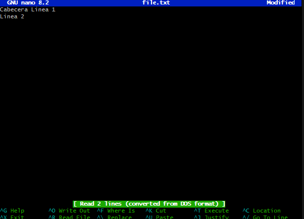

# Explorando diferentes formas de fusionar en Git
### **Objetivo de aprendizaje:**  
En esta actividad, exploraremos el proceso de fusionar dos ramas en Git utilizando tres métodos diferentes: fast-forward, no-fast-forward y squash. A través de los ejemplos, comprenderás cómo funcionan y cuándo es recomendable utilizar cada tipo de fusión.
#### Contexto
En el mundo del desarrollo de software, Git se ha consolidado como una herramienta esencial para la gestión de versiones, permitiendo a equipos y desarrolladores individuales llevar un control preciso de los cambios en el código fuente.
Dentro de Git, las fusiones juegan un rol fundamental al combinar el trabajo de diferentes ramas, integrando características, correcciones y mejoras al código base. 
#### Contenido
- [Fusión Fast-forward](#1-fusión-fast-forward)
- [Fusión Fusión No-Fast-forward](#2-fusión-no-fast-forward)
- [Fusión squash](#3-fusión-squash)
- [Ejercicios](Ejercicios)
## 1. Fusión Fast-forward
La fusión **fast-forward** ocurre cuando la rama de destino no tiene commits adicionales desde que se creó la rama a fusionar, lo que permite avanzar directamente el hash de la rama de destino hasta el último commit de la rama fuente, sin crear un nuevo commit de fusión.
Este tipo de fusión no altera el historial (log), por lo que seguirá permaneciendo de forma lineal.
### a. Estructura base del proyecto: 
```bash
mkdir prueba-fast-forward-merge
cd prueba-fast-forward-merge
echo "# Mi proyecto" > README.md
git add README.md
# Primer commit de la rama master
git commit -m "Commit inicial en master"

# Creación de una nueva rama
git checkout -b add-description
echo "Este proyecto es un ejemplo de cómo usar Git." >> README.md
git add README.md

# Primer commit de la rama add-description
git commit -m "Agregar descripción al archivo README.md"
```
### b. Estructura de commits resultante

## 2. Fusión No-Fast-forward
La fusión **no fast-forward** es utilizada cuando se desea conservar explícitamente un commit de fusión, incluso si una fusión **fast-forward** sería posible; esto permite mantener un historial con ramas claramente diferenciadas.
### a. Estructura Base
```bash
mkdir prueba-no-fast-forward-merge
cd prueba-no-fast-forward-merge

echo "# Mi proyecto" > README.md
git add README.md
git commit -m "Commit inicial en master"

git checkout -b add-feature
echo "Implementar nueva característica" >> README.md
git add README.md
git commit -m "Implementar característica en README.md"
```
### b. Historial de commits resultante
```bash
git checkout master
git merge --no-ff add-feature
```
Se aprecia en la imagen como se crea una linea paralela `add-feature` con el commit realizado en dicha rama a la hora de haber utilizado `merge --no-ff`, a comparación de `merge --ff` donde el historial de commits permanece lineal.

## 3. Fusión squash
la fusión **squash** combina todos los commits de una rama en uno solo antes de fusionarla con la rama principal, lo que da como resultado un historial más limpio y lineal, aunque se pierde el detalle de los commits individuales originales.
### a. Estructura Base
```bash
mkdir prueba-squash-merge
cd prueba-squash-merge

echo "# Mi proyecto" > README.md
git add README.md
git commit -m "Commit inicial en master"

git checkout -b add-basic-files
echo "# Cómo contribuir" > CONTRIBUTING.md
git add CONTRIBUTING.md
git commit -m "Agregar archivo CONTRIBUTING.md al proyecto"
echo "# LICENCIA" > LICENSE.txt
git add LICENSE.txt
git commit -m "Agregar archivo LICENSE.txt al proyecto"
```
### b. Estructura de los commits
```bash
git merge --squash add-basic-files
```
Tanto `git merge --squash` como `git merge --ff` dejan un historial más limpio a comparación de `git merge --no-ff`, haciendolo útil para aquellos commits que no se requiera visualizar si han sido creados en ramas diferentes de la principal.

# Ejercicios
## 1. Resolver conflictos en una fusión non-fast-forward
- Inicializar el repositorio
```bash
mkdir prueba-merge-conflict
cd prueba-merge-conflict
git init
```
- Crea archivo index.html y hacer el commit de este en main
```bash
echo "<html><body><h1>Pryecto inicial de CC3S2A></h1></body></html>" > index.html
git add index.html
git commit -m "Añadir archivo index.html a la rama master"
```
- Cambio de rama y actualización a index.html
```bash
git checkout -b feature-update
echo "<p>esto es un parrafo</p>" >> index.html
git add index.html
git commit -m "Actualizar el archivo index.html con un parrafo"
```
- Regreso a la rama main y actualizo desde ahí a index.html
```bash
git checkout master
echo "<footer>Contacta aquí: cinver.espinoza.v@uni.pe</fotter>" >> index.html
git add index.html
git commit -m "Agregar footer al archivo index.html"
```
- Fusión de la rama feature-update con --no-ff
```bash
git merge --no-ff feature-update
```
- Al intentar hacer la fusión habrá un conflicto, asi que procedo a revisar el código con `nano` para actualizar index.html.


- Una vez arreglado el conflicto se guarda y se termina el mergeo.


```bash
git add index.html
git commit -m "Arreglar merge conflictivo en index.html"
```

- Revisión del historial.


### ¿Qué pasos adicionales tuviste que tomar para resolver el conflicto?
Entré con ayuda de nano al "index.html" para resolver el conflicto, vi que habían 2 versiones distintas para el mismo archivo asi que intenté acoplar las dos versiones en un mismo "index.html", borrando los "==== " y las cabeceras "HEAD" y "feature-update" en ambos casos.

### ¿Qué estrategias podrías emplear para evitar conflictos en futuros desarrollos?
Para futuros trabajos se puede emplear squash para el caso de añadir código nuevo al "index.html", ya que solo se colocaría en una línea de texto posterior a la que ya se tiene inicialmente, por lo que no existirían problemas de mergeo

## 2. Comparar los historiales con git log después de diferentes fusiones
**Estructura inicial: **
```bash
mkdir prueba-compare-merge
cd prueba-compare-merge
git init
echo "Version 1.0" > version.txt
git add version.txt
git commit -m "Añadir version.txt"
```
**Agregar característica en las ramas feature-1 y feature-2**
```bash
git checkout -b feature-1
echo "Característica 1 agregada" >> version.txt
git add version.txt
git commit -m "Agregar característica 1 al archivo version.txt"

git checkout master

git checkout -b feature-2
echo "Característica 2 agregada" >> version.txt
git add version.txt
git commit -m "Agregar característica 2 al archivo version.txt"
```
**Realizar merge --ff y --no-ff para cada una de las ramas hacia la rama master**
```bash
git checkout master

git merge feature-1 --ff
# No ocasionó ningun conflicto

git merge feature-2 --no-ff
# Ocasionó conflicto entre características añadidas
```
#### Validación:


### Antes de solucionar el conflicto


### Después de solucionar el conflicto


**Se soluciona el conflicto y se crea un commit para salir del estado `MERGING`**
```bash
nano version.txt
git add version.txt
git commit -m "Agregar las características al archivo version.txt"
# Salida del estado MERGING
```
**Agregar la característica 3 para hacer la fusión squash**
```bash
git checkout master
git checkout -b feature-3
echo "Característica 3 paso 1" >> version.txt
git add version.txt
git commit -m "Añadir primera versión de la Característica 3 dentro del archivo version.txt"


echo "Característica 3 paso 2" >> version.txt
git add version.txt
git commit -m "Añadir segunda versión de la Característica 3 dentro del archivo version.txt"
```
**Realizar la fusión squash de la rama feature-3 con la rama master**
```bash
git checkout master
git merge --squash feature-3
git commit -m "Agregar característica 3 completa a la rama master"
```
**Observar los cambios con el comando `git log`**


### ¿Cómo se ve el historial en cada tipo de fusión?
- Fast-forward: El historial es lineal, como si los commits de la rama secundaria hubieran sido hechos directamente en la rama principal. No hay commit de fusión.
- No fast-forward: Se crea un merge commit que une las dos ramas, conservando la divergencia del historial.
- Squash: Se combinan todos los commits de la rama secundaria en uno solo, y ese único commit se aplica a la rama principal, sin conservar el historial detallado de la rama.
### ¿Qué método prefieres en diferentes escenarios y por qué?
- Fast-forward: Cuando prefiera mantener un historial limpio y lineal, haciendo uso de ramas con cambios pequeños como bugfixes o mejoras pequeñas en el código.
- No fast-forward: Útil en entornos colaborativos o con revisión de código, ya que muestra cada uno de las divisiones de ramas y ayuda a entender la historia del proyecto.
- Squash: Muy útil cuando se desea mantener un historial limpio y enfocado, especialmente cuando una rama tiene muchos commits irrelevantes o intermedios.
## 3. Usando fusiones automáticas y revertir fusiones
- Inicializar un repositorio y realiza dos commits en **main**
```bash
mkdir prueba-auto-merge
cd prueba-auto-merge
git init

echo "Linea 1" > file.txt
git add file.txt
git commit -m "Añadir file.txt al proyecto"

echo "Linea 2" >> file.txt
git add file.txt
git commit -m "Añadir linea 2 en file.txt"
```
- Creación de la rama **auto-merge** y commit en **file.txt**
```bash
git checkout -b auto-merge
echo "Linea 3" >> file.txt
git add file.txt
git commit -m "Añadir una linea al archivo file.txt"
```
- Se vuelve a la rama **master** y se realiza cambios en **file.txt** no conflictivos.
```bash
git checkout master
nano file.txt
```



```bash
git add file.txt
git commit -m "Añadir cabecera al archivo file.txt"
```
- Fusión de la rama **auto-merge** con **master**


- Reversión de los cambios hechos a la hora de fusionar las ramas con el comando `git revert`


- Revisión del historial después de hacer tanto `git merge` y `git revert` para ver los cambios en el arbol.


### a. ¿Cuándo usarías un comando como git revert para deshacer una fusión?
Cuando haga cambios incompletos, o que el cambio provoque algún conflicto en la lógica del proyecto. Quizás el cambio empeore el código y se necesita hacer un revert al commit.
### b. ¿Qué tan útil es la función de fusión automática en Git?
Sirve mucho para no tener que revisar manualmente todas las fusiones que hagamos como desarrolladores, optimizando el tiempo revisando código. Más que nada cuando se hagan cambios que agreguen más código o modifiquen código en líneas ya existentes.


