# Actividad 6
# Parte 1: git rebase para mantener un historial lineal
### Escenario del ejemplo
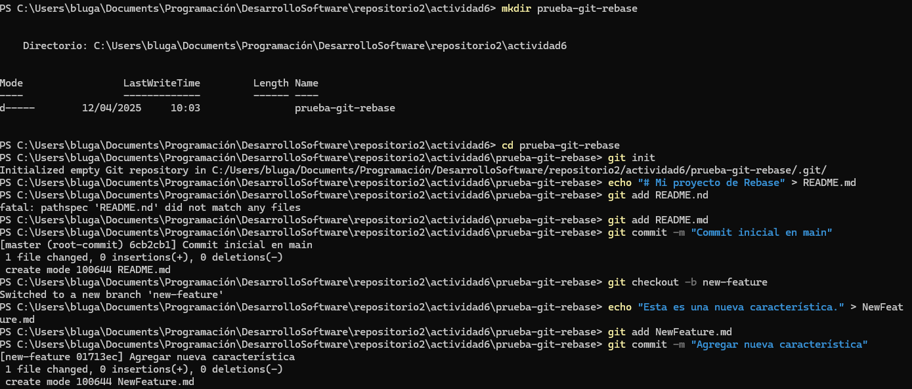
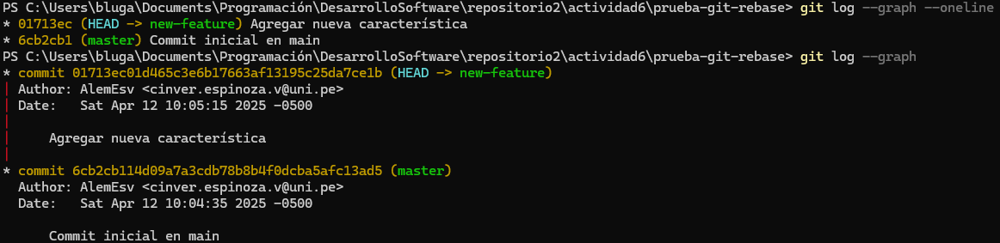
#### **Tarea**: Realiza el rebase de `new-feature` sobre `main` con los siguientes comandos:
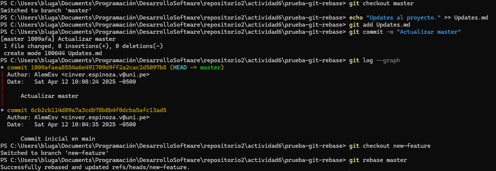
#### Revisión final:
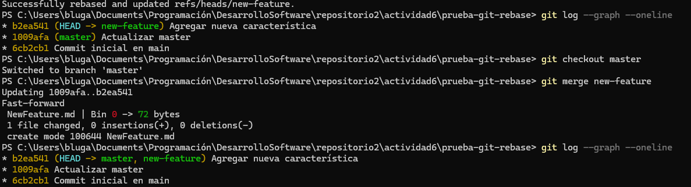
# Parte 2: git cherry-pick para la integración selectiva de commit
#### Escenario de ejemplo
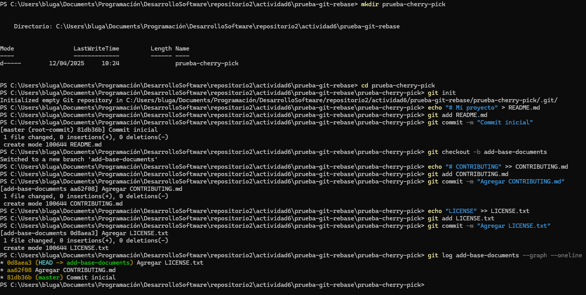
#### **Pregunta:** Muestra un diagrama de como se ven las ramas en este paso.
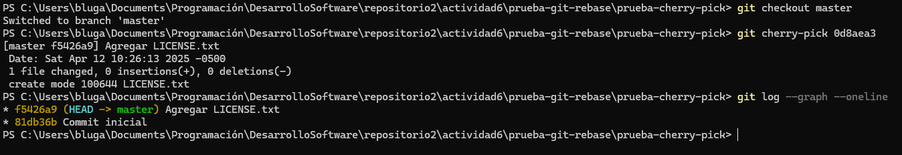
##### **Preguntas de discusión:**

#### 1. ¿Por qué se considera que rebase es más útil para mantener un historial de proyecto lineal en comparación con merge?  
texto_ejemplo
#### 2. ¿Qué problemas potenciales podrían surgir si haces rebase en una rama compartida con otros miembros del equipo?  
texto_ejemplo
#### 3. ¿En qué se diferencia cherry-pick de merge, y en qué situaciones preferirías uno sobre el otro?  
texto_ejemplo
#### 4. ¿Por qué es importante evitar hacer rebase en ramas públicas?
texto_ejemplo
#### **Ejercicios teóricos**

#### 1. **Diferencias entre git merge y git rebase**  
   **Explica la diferencia entre git merge y git rebase y describe en qué escenarios sería más adecuado utilizar cada uno en un equipo de desarrollo ágil que sigue las prácticas de Scrum.**
dddd

#### 2. **Relación entre git rebase y DevOps**  
- **¿Cómo crees que el uso de git rebase ayuda a mejorar las prácticas de DevOps, especialmente en la implementación continua (CI/CD)? Discute los beneficios de mantener un historial lineal en el contexto de una entrega continua de código y la automatización de pipelines.**
aaaa

#### 3. **Impacto del git cherry-pick en un equipo Scrum**  
- **Un equipo Scrum ha finalizado un sprint, pero durante la integración final a la rama principal (main) descubren que solo algunos commits específicos de la rama de una funcionalidad deben aplicarse a producción. ¿Cómo podría ayudar git cherry-pick en este caso? Explica los beneficios y posibles complicaciones.**
aaaa

### ejercicios prácticos
#### 1. Simulación de un flujo de trabajo Scrum con git rebase y git merge
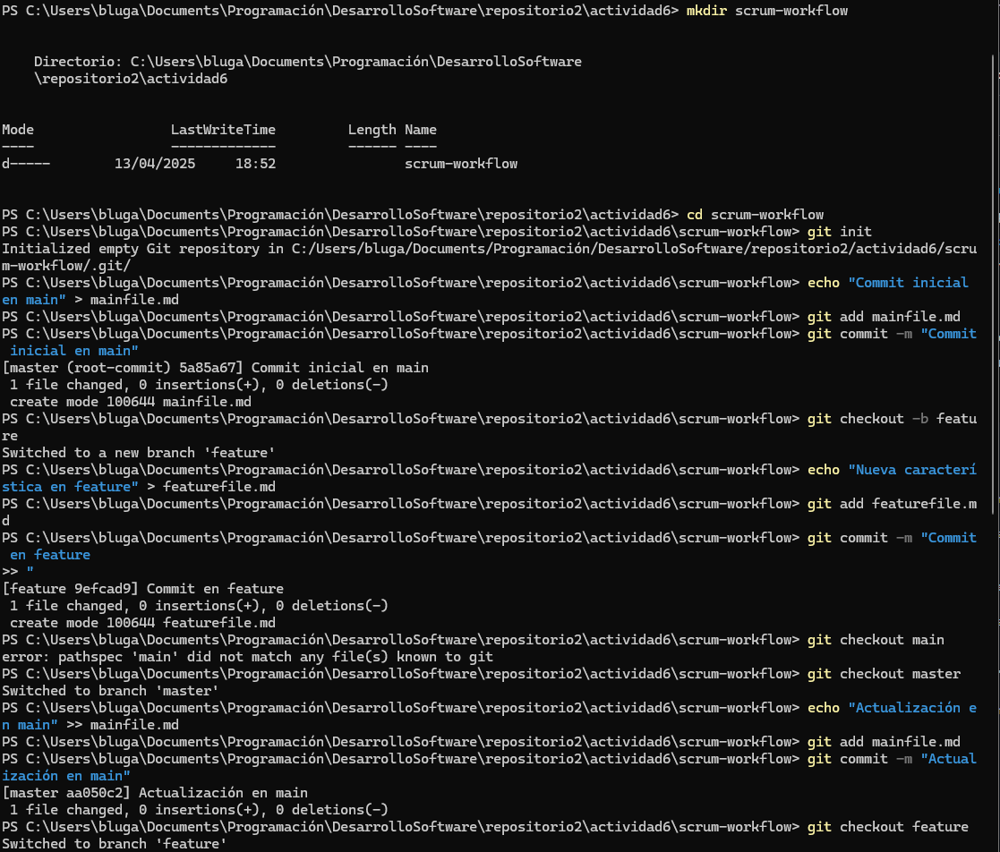
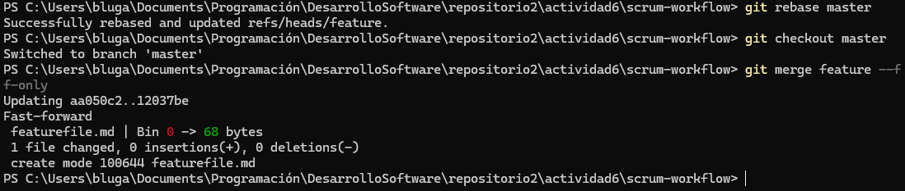
#### Preguntas:
- **¿Qué sucede con el historial de commits después del rebase?**
Se fusionó el commit **Actualización en main** en la rama principal
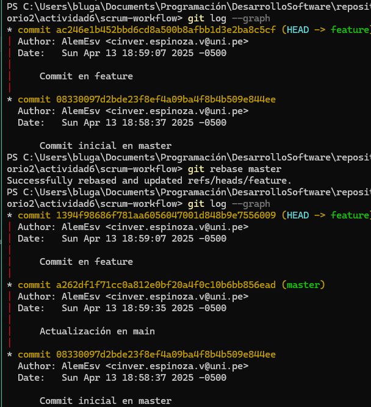
- **¿En qué situación aplicarías una fusión fast-forward en un proyecto ágil?**
Sería muy útil para proyectos en los que la rama principal no avance mientras se trabajaba en las ramas generadas.
#### 2. Cherry-pick para integración selectiva en un pipeline CI/CD
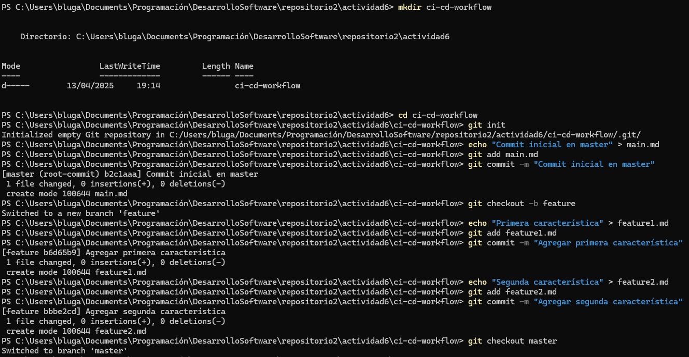
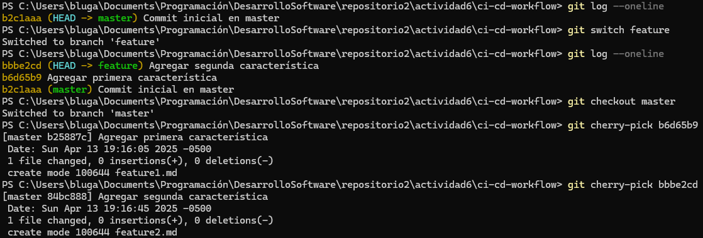
#### Preguntas:
- **¿Cómo utilizarías cherry-pick en un pipeline de CI/CD para mover solo ciertos cambios listos a producción?**
Usaría cherry-pick para casos en los cuales necesito usar ciertas funciones de otra rama que no hayan estado en el momento en que yo creé mi rama. Otra utilidad que le encuentro es cuando al trabajar sobre una rama encuentro un error que otra persona del equipo ya lo arregló en su rama, asi que podría 
- **¿Qué ventajas ofrece cherry-pick en un flujo de trabajo de DevOps?**
con cherry-pick puedes dar uso de commits hechos en diferentes ramas que pueden ayudar a tener funciones agregadas a la rama donde estás trabajando sin necesidad de colocarse en esa rama y hacer varios merges.
# **Git, Scrum y Sprints**
## Ejercicio 1: Crear ramas de funcionalidades (feature branches)
### Crear repositorio, crear rama **main** y dos ramas para usuarios
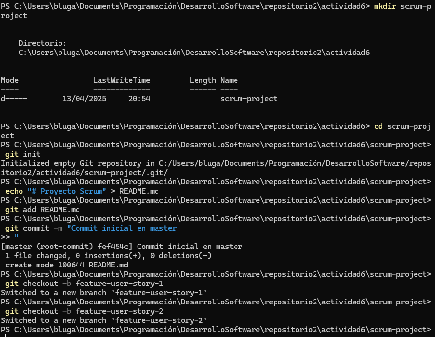
### ¿Por qué es importante trabajar en ramas de funcionalidades separadas durante un sprint?
Al cada rama no estar conectada directamente con las demás, cada persona puede avanzar por cada funcionalidad sin necesidad de estar en constante pregunta con su equipo para que sus cambios no hagan conflictos con los demás, además hace tener un trabajo mejor organizado y óptimo para no hacer cambios improvistos que dañen el código a largo plazo.
## Ejercicio 2: Desarrollo del sprint (sprint execution)
### Hacer commits en main y un rebase en una de las ramas creadas
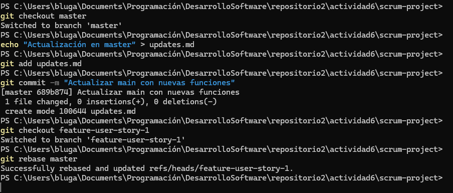
### ¿Qué ventajas proporciona el rebase durante el desarrollo de un sprint en términos de integración continua?
Estos rebase son útiles si hay funcionalidad nuevas implementadas en la rama principal y quieres tener esas funcionalidades dentro de la rama de tu trabajo, por lo que puedes implementar estos cambios hechos en los commits posteriores a la creación de tu rama como si fueran cambios puestos antes de que comenzara tu etapa de desarrollo.
## Ejercicio 3: Integración selectiva con `git cherry-pick`
### Realizar cambios en la rama feature-user-story-2 y cherry-pick en main
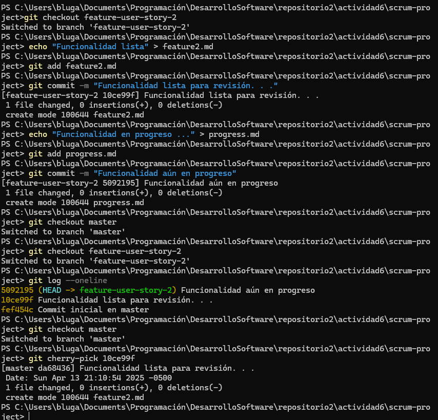
### ¿Cómo ayuda `git cherry-pick` a mostrar avances de forma selectiva en un sprint review?
al usar `git cherry-pick` puedes tomar uno o varios commits de otras ramas y aplicarla a la que estés trabajando, por lo que puedes implementar avances funcionales y completos a tu rama sin necesidad de conectarte con main u otra rama que tenga otros cambios que puedan provocar un posible conflicto entre archivos.
## Ejercicio 4: Revisión de conflictos y resolución
### Cambios en las subramas de los usuarios para resolver conflictos y hacer un merge exitoso
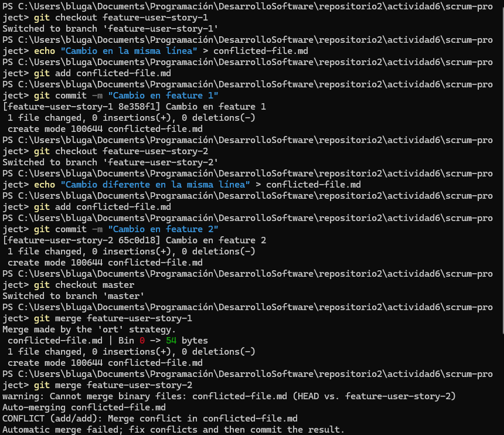
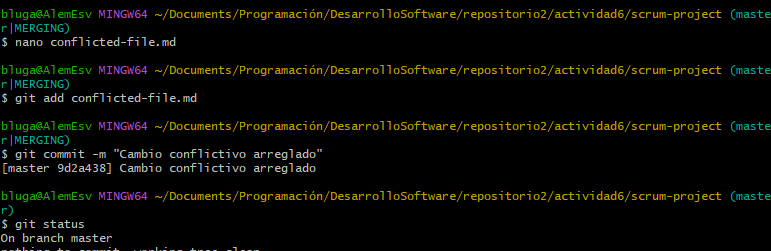
### ¿Cómo manejas los conflictos de fusión al final de un sprint? 
Al haber un conflicto de fusión reviso con `nano (archivo)` los posibles conflictos y arreglo manualmente cada uno de los archivos en conflicto para asegurarme que no pase nada a la hora de hacer una fusión con otra rama, como por ejemplo la rama **main**
### ¿Cómo puede el equipo mejorar la comunicación para evitar conflictos grandes?
Haciendo divisiones de un trabajo por ramas que no toquen los mismos archivos, y que no modifiquen partes del código que afecten a las demás partes encargadas del desarrollo del software. Además, la necesidad de hacer commits frecuentes en cada rama para visualizar si algunas funciones están completadas o si falta darles revisiones ayudan a evitar conflictos a gran escala. 
## Ejercicio 5: Automatización de rebase con hooks de Git
### Configurar un hook `pre-push` para un rebase en la rama master y su respectiva prueba.
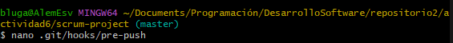
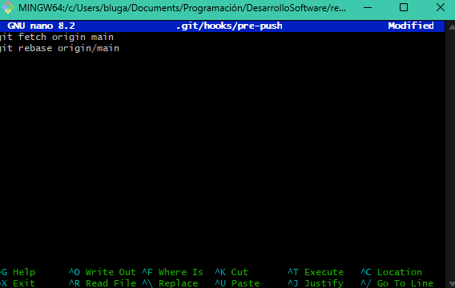
### ¿Qué ventajas y desventajas observas al automatizar el rebase en un entorno de CI/CD?
El rebase permite evitar commits de fusiones innecesarias, dejando un historial claro y fácil de leer para los demás integrantes del proyecto. También facilita la revisión de cambios con `git log`.
# Navegando conflictos y versionado en un entorno devOps
## Ejemplo:
### Inicialización del proyecto y creación de ramas
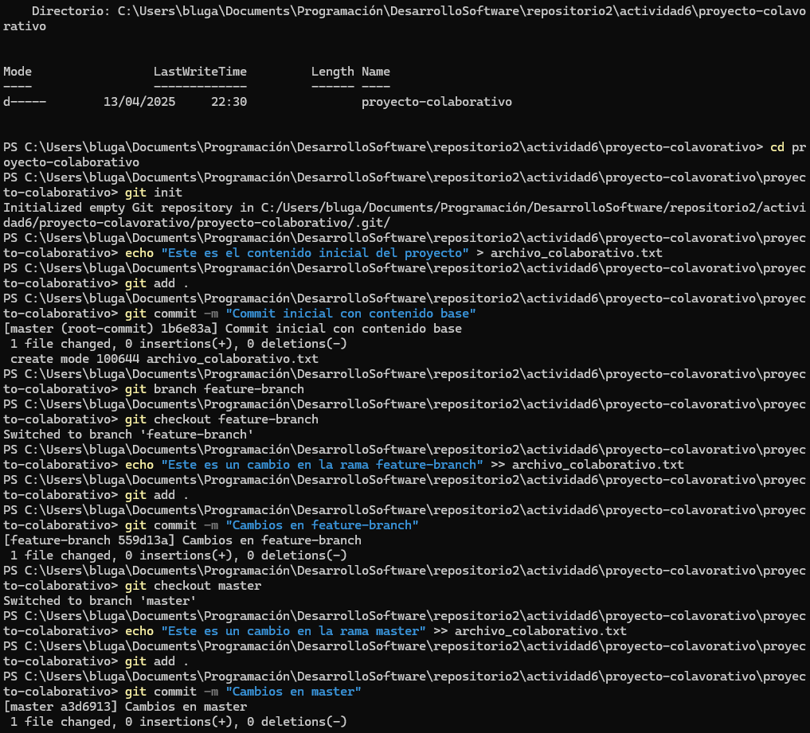
### Fusión y resolución de conflictos
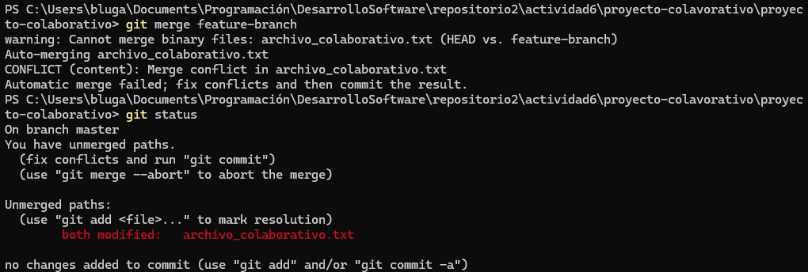
### Simulación de fusiones y uso de git diff
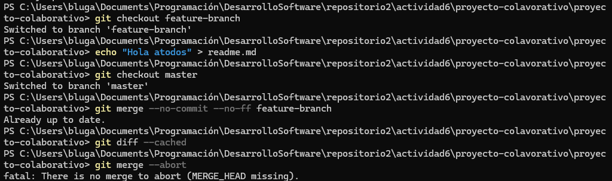
### Uso de git mergetool
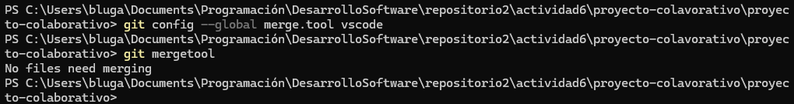
### Uso de git revert y git reset
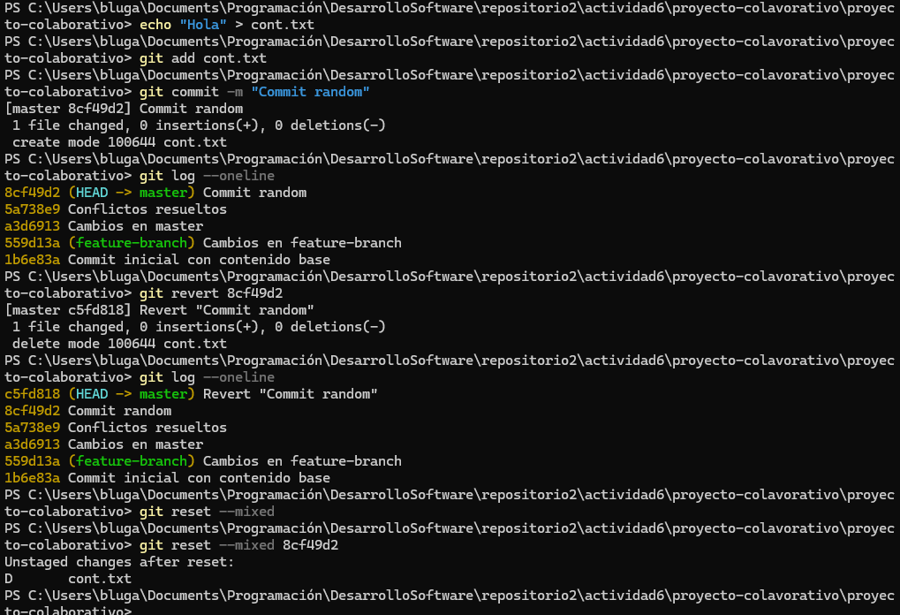
### Versionado semántico y etiquetado
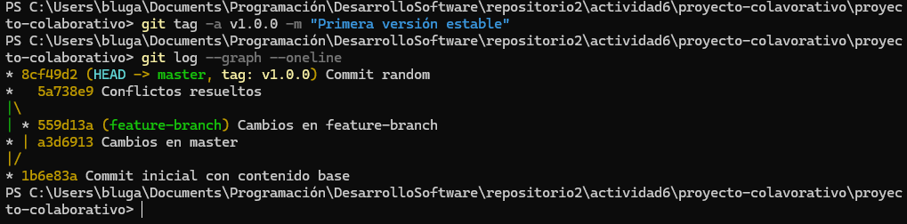
### Aplicación de git bisect para depuración
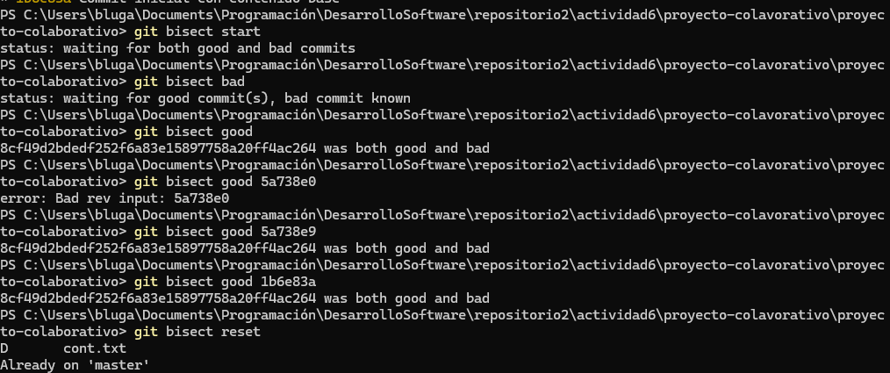
