## Ejercicio 1: **Añadir soporte para minutos y segundos en tiempos de espera**
##### Cambio en la clase **steps.py**, para que el *pattern* soporte tiempo de espera para segundos.
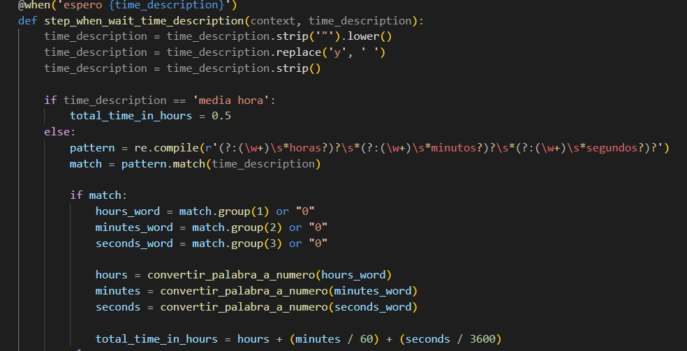
#### Salida Gherkin:
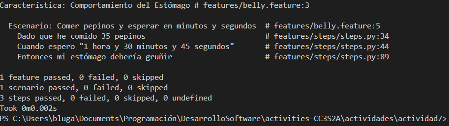
## Ejercicio 2: **Manejo de cantidades fraccionarias de pepinos**
##### Se hace una modificación en la clase **steps.py** para que pueda manejar cantidades fraccionarias. Por lo que se registra un `register_type` para pasar el texto en un dato flotante, que permita decimales.
```
from behave import given, when, then, register_type
import re
```
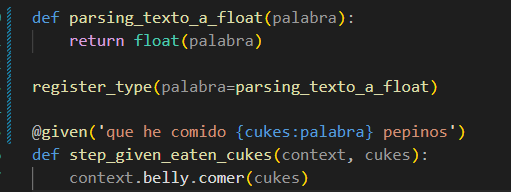
#### Salida Gherkin:
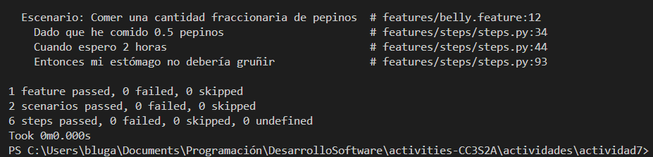
#### Prueba con pytest de la prueba unitaria:
##### Uso la misma lógica que la salida Gherkin, pero esta vez para validarlo con pruebas de `pytest`.
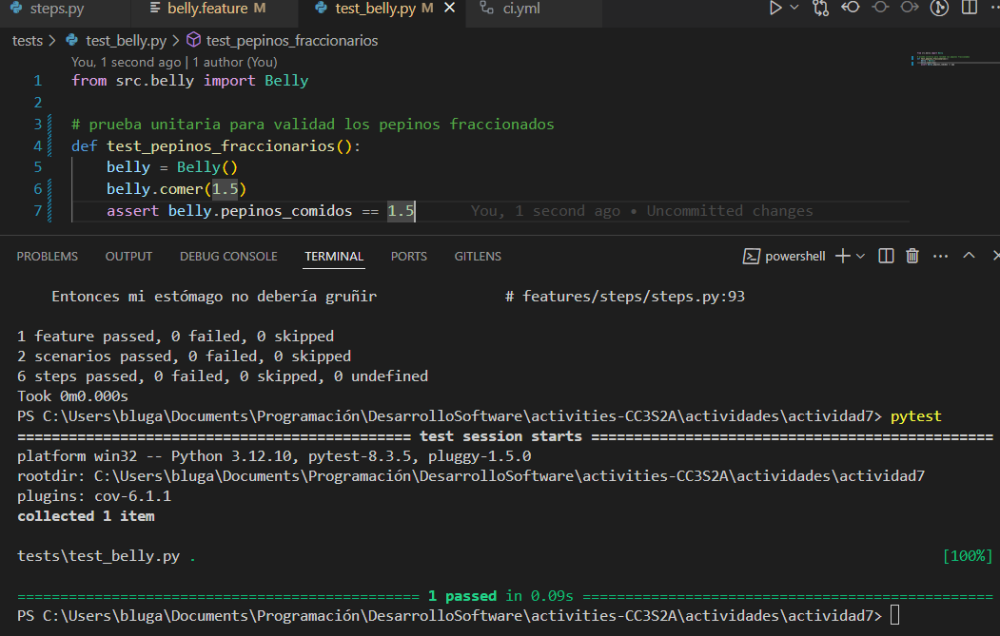
## Ejercicio 3: **Soporte para idiomas múltiples (Español e Inglés)**
##### Modificación de la función `convertir_palabra_a_numero()` para que verifique valores en español e inglés.
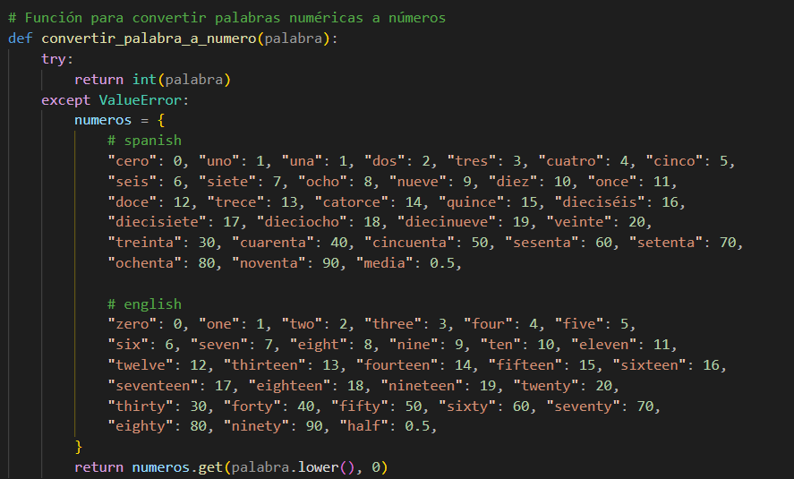
##### Dentro de `@when('espero {time_description}')` se agrega expresiones RegEx para denotar si se está agregando una hora en español o en inglés.
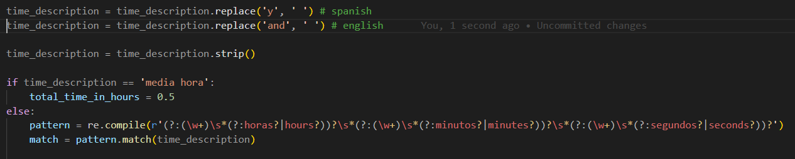
#### Salida Gherkin:
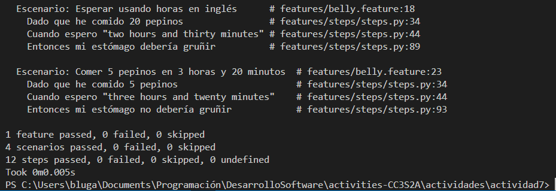
## Ejercicio 4: **Manejo de tiempos aleatorios**
##### Modificación en la función `step_with_time_description()` para que pueda leer entradas de **Cuando espero un tiempo aleatorio...** donde debo usar otro patrón que coloque valores aleatorios entre dos horas en especifico. 
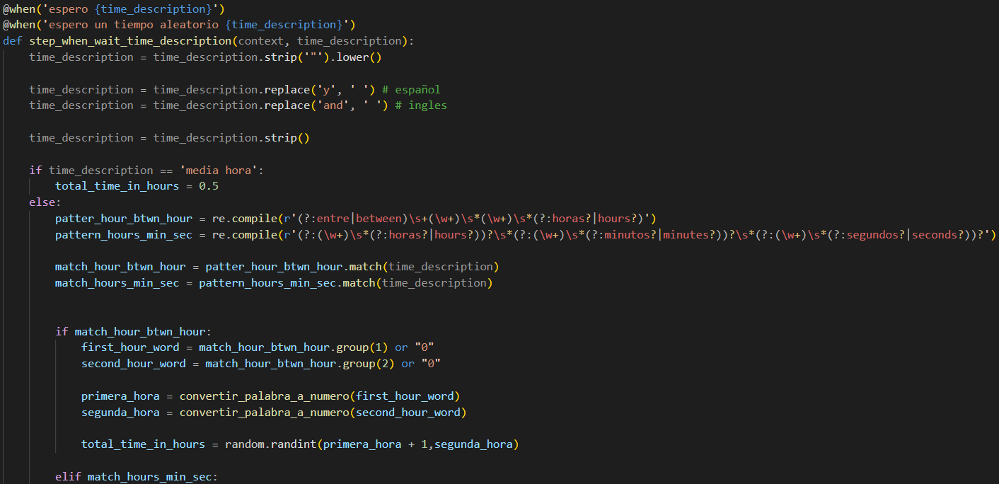
#### Salida Gherkin:
)
## Ejercicio 5: **Validación de cantidades no válidas**
##### Modificación en `step_given_eaten_cukes(context, cukes)` para que no acepte valores negativos a la hora de comer pepinos.
##### Busca un error y lo guarda para ser posteriormente.
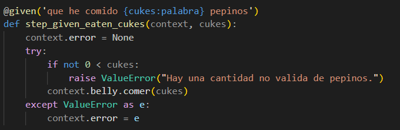
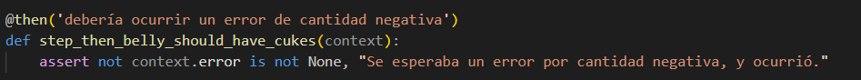
#### Salida Gherkin:
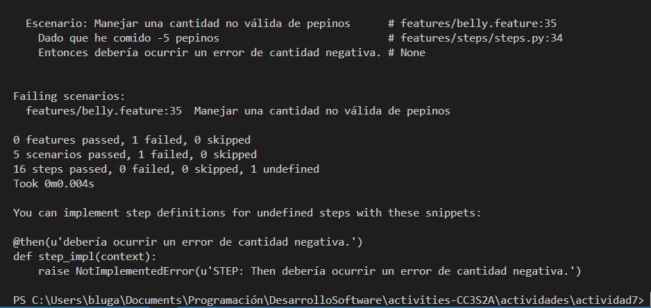
## Ejercicio 6: **Escalabilidad con grandes cantidades de pepinos**
##### Soporte para cantidad grandes verificando que el código no demora tanto en validar dichos valores.
#### Salida Gherkin:
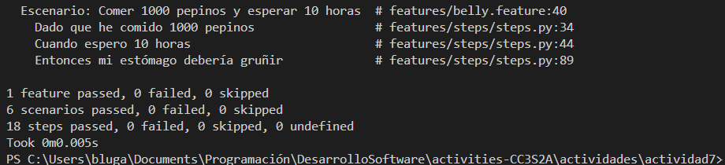
## Ejercicio 7: **Descripciones de tiempo complejas**
##### Se añade un reemplazo de comas para que pueda aceptar tiempos que cubran horas, minutos y horas.
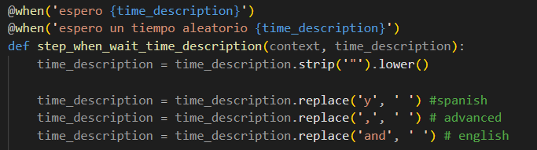
#### Salida Gherkin:
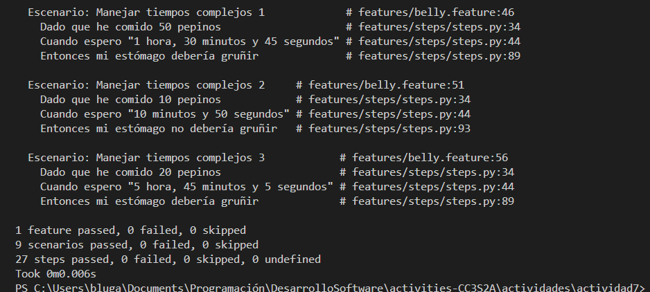
## Ejercicio 8: **De TDD a BDD – Convertir requisitos técnicos a pruebas en Gherkin**
##### Prueba de añadir una prueba unitaria básica con `Pytest` para que valide que si se han comido más de 15 pepinos y se espera 2 horas, el estómago gruñe.
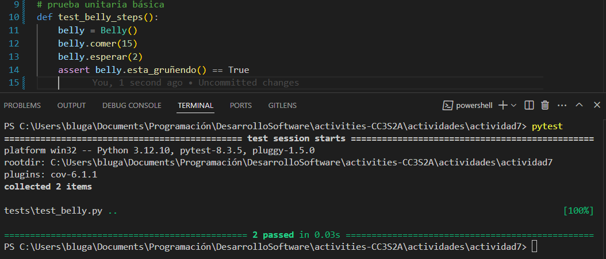
#### Salida Gherkin: 
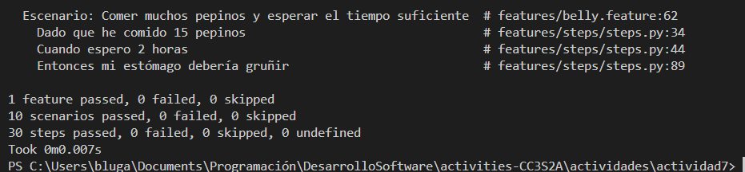
## Ejercicio 9: **Identificación de criterios de aceptación para historias de usuario**
##### Se registra la historia de nuestro primer usuario, y se crean 2 escenarios modelados a la historia presentada.
#### Salida Gherkin: 
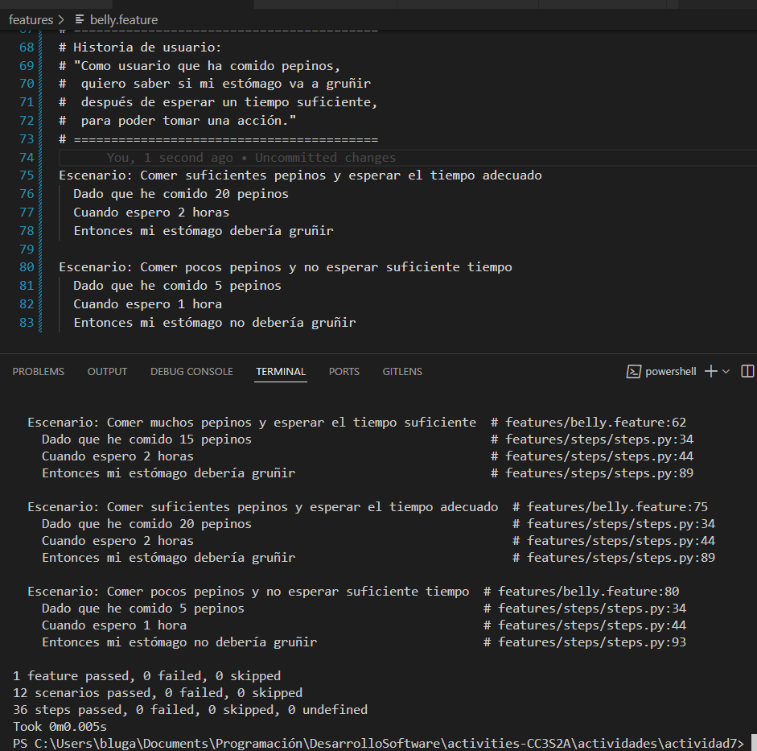
## Ejercicio 10: **Escribir pruebas unitarias antes de escenarios BDD**
#### Demostrar la secuencia TDD (tests unitarios) → BDD (escenarios).
##### Creación de un test unitario para observar si la función **comer()** acepta bien la cantidad de pepinos comidos.
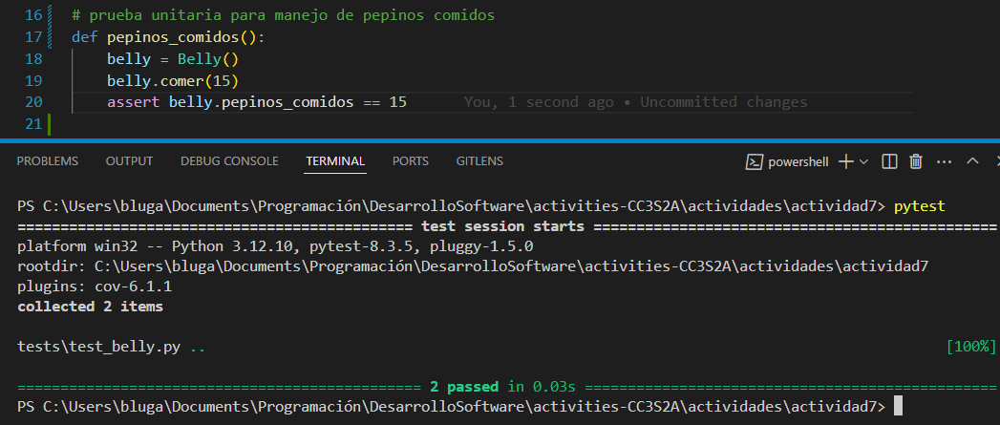
##### Ahora toca pasar el test unitario a un escenario en Gherkin implementando los pasos en Behave.
##### Se agrega un `@then(...)` que lea lo puesto en `.feature`
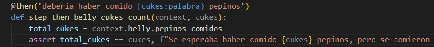
#### Salida Gherkin:
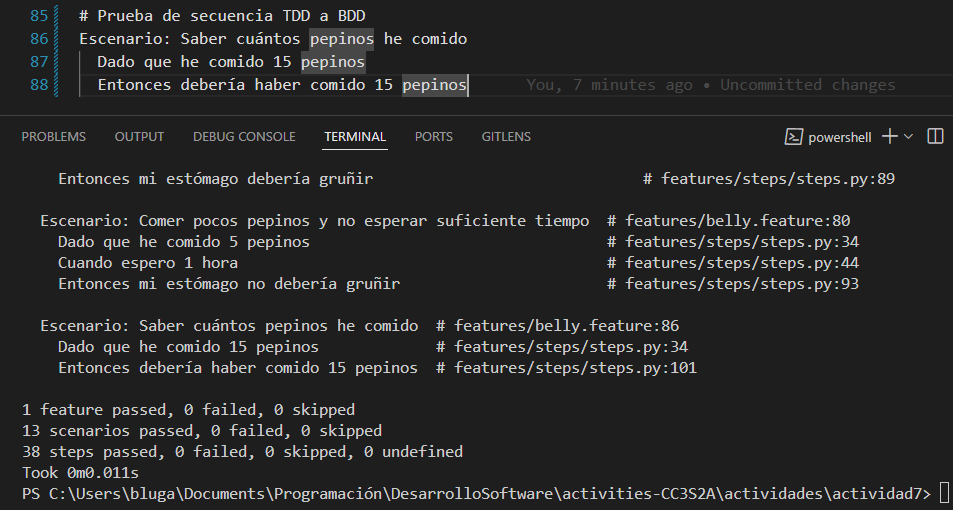
## Ejercicio 11: **Refactorización guiada por TDD y BDD**
#### Pruebas unitarias:
##### Se eliminan pruebas unitarias repetidas y refactorización en el código.
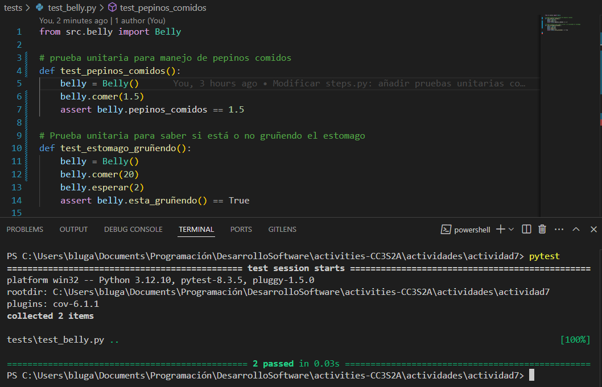
#### Salida Gherkin:
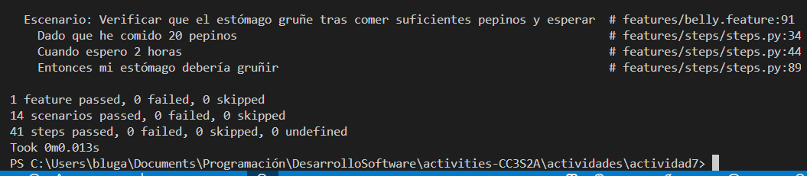
## Ejercicio 12: **Ciclo completo de TDD a BDD – Añadir nueva funcionalidad**
##### Se prueba una nueva funcionalidad que siga "Predecir si el estómago gruñirá con una cantidad dada de pepinos y un tiempo de espera" como una TDD(prueba unitaria)
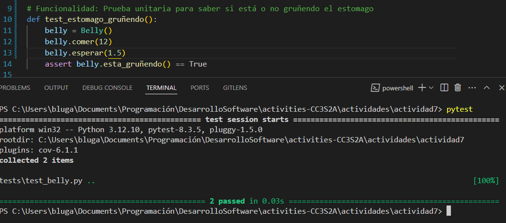
##### Luego se prueba la BDD de la funcionalidad para estar seguro del testeo.
#### Primera salida Gherkin:
##### al dejar de cumplir que las horas de espera sean mayores a 1.5 horas, suelta el *assertion* de que el estómago no gruñirá.
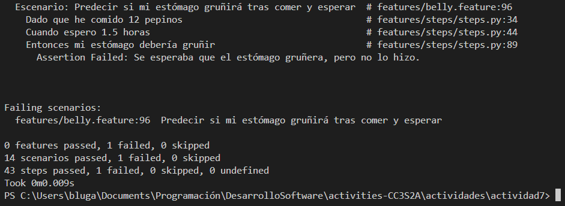
##### Se prueba otro caso con unas horas adecuadas.
#### Segunda salida Gherkin:
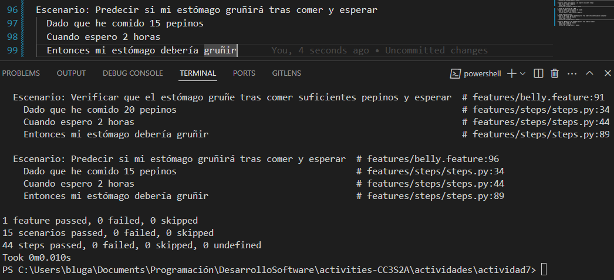
## Ejercicio 13: **Añadir criterios de aceptación claros**
##### Se agrega la función `calcular_pepinos_restantes()` para poder ver cuantos pepinos más puede comer sin llenarse, respecto a la historia del usuario agregada.
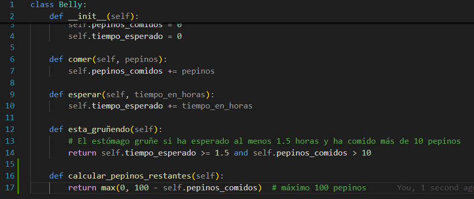
##### Se agregan nuevos `@when` y `@then` para el nuevo casi puesto por el usuario.
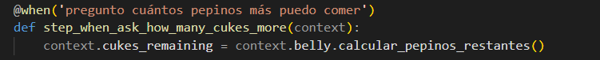
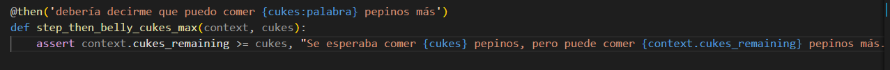
#### Salida Gherkin:
##### Muestra que podrá comerse X cantidad de pepinos sin llenarse (100 como máximo)
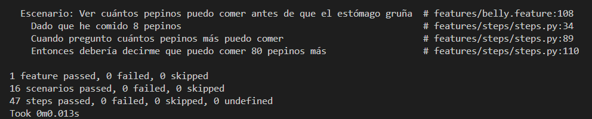
## Ejercicio 14: **Integración con Mocking, Stubs y Fakes (para DevOps)**
##### Se crea `clock.py` para simular un reloj

##### y se importa a `belly.py`
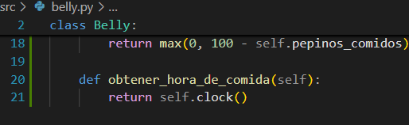
##### Modificación de `environment.py` para que pueda inyectar un ock del reloj en el `before_scenario`
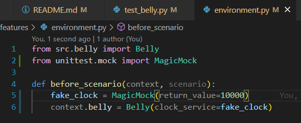
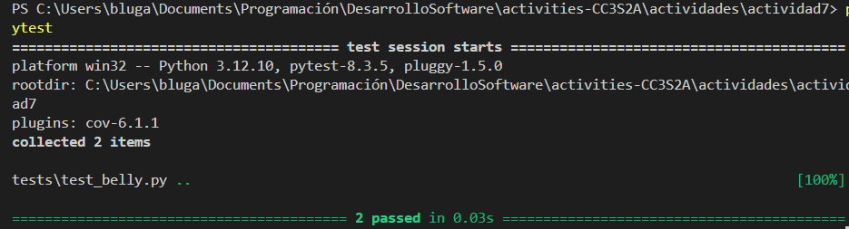