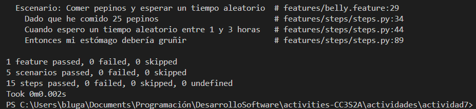

# Pruebas BDD con behave

Este proyecto es un ejemplo de cómo utilizar **behave**, una herramienta para pruebas de desarrollo dirigido por comportamiento (Behavior-Driven Development - BDD) en Python, para escribir y ejecutar pruebas en español. Simula el comportamiento de un estómago (`Belly`) que gruñe o no en función de la cantidad de pepinos consumidos y el tiempo de espera.

## Ejercicio 1: **Añadir soporte para minutos y segundos en tiempos de espera**
**Objetivo**  
- Ampliar la funcionalidad para reconocer tiempos de espera expresados en horas, minutos y segundos.
Cambio en la clase **steps.py**, para que el *pattern* soporte tiempo de espera para segundos.
```python
@when('espero {time_description}')
def step_when_wait_time_description(context, time_description):
# (... código anterior ...)
else:
  pattern = re.compile(r'(?:(\w+)'s*horas?)?\s*(?:(\w+)\s*minutos?)?\s*(?:(\w+)\s*segundos?)?')
  match = pattern.match(time_description)

  if match:
    hours_word = match.group(1) or "0"
    minutes_word = match.group(2) or "0"
    seconds_word = match.group(3) or "0"

    hours = convertir_palabra_a_numero(hours_word)
    minutes = convertir_palabra_a_numero(minutes_word)
    seconds = convertir_palabra_a_numero(seconds_word)

  total_time_in_hours = hours + (minutes / 60) + (seconds / 3600)
# (... código posterior ...)
```
Para las pruebas BDD analizaré el siguiente escenario:
```gherkin
Característica: Comportamiento del Estómago
  Escenario: Comer pepinos y esperar en minutos y segundos
    Dado que he comido 35 pepinos
    Cuando espero "1 hora y 30 minutos y 45 segundos"
    Entonces mi estómago debería gruñir
```
- **Salida BDD:**


## Ejercicio 2: **Manejo de cantidades fraccionarias de pepinos**
**Objetivo**  
- Permitir que el sistema acepte cantidades fraccionarias de pepinos (decimales).
Se hace una modificación en la clase **steps.py** para que pueda manejar cantidades fraccionarias. Por lo que se registra un `register_type` para pasar el texto en un dato flotante, que permita decimales.
```python
from behave import given, when, then, register_type
import re
def parsing_texto_a_float(palabra):
  return float(palabra)

register_type(palabra=parsing_texto_a_float)

@given('que he comido {cukes:palabra} pepinos')
def step_given_eaten_cukes(context, cukes):
  context.belly.comer(cukes)
```
- Salida Gherkin:


### Prueba con pytest:
Uso la misma lógica que la salida Gherkin, pero esta vez para validarlo con pruebas de `pytest`.
```python
def test_pepinos_fraccionarios():
  belly = Belly()
  belly.comer(1.5)
  assert belly.pepinos_comidos == 1.5
```
- Salida con Pytest:


## Ejercicio 3: **Soporte para idiomas múltiples (Español e Inglés)**
**Objetivo**  
- Aceptar descripciones de tiempo en distintos idiomas (español e inglés).
Modificación de la función `convertir_palabra_a_numero()` para que verifique valores en español e inglés.

```python
# Función para convertir palabras numéricas a números
def convertir_palabra_a_numero(palabra):
    try:
        return int(palabra)
    except ValueError:
        numeros = {
            # español
            "cero": 0, "uno": 1, "una": 1, "dos": 2, "tres": 3, "cuatro": 4, "cinco": 5,
            "seis": 6, "siete": 7, "ocho": 8, "nueve": 9, "diez": 10, "once": 11,
            "doce": 12, "trece": 13, "catorce": 14, "quince": 15, "dieciséis": 16,
            "diecisiete": 17, "dieciocho": 18, "diecinueve": 19, "veinte": 20,
            "treinta": 30, "cuarenta": 40, "cincuenta": 50, "sesenta": 60, "setenta": 70,
            "ochenta": 80, "noventa": 90, "media": 0.5,
        
            # ingles
            "zero": 0, "one": 1, "two": 2, "three": 3, "four": 4, "five": 5,
            "six": 6, "seven": 7, "eight": 8, "nine": 9, "ten": 10, "eleven": 11,
            "twelve": 12, "thirteen": 13, "fourteen": 14, "fifteen": 15, "sixteen": 16,
            "seventeen": 17, "eighteen": 18, "nineteen": 19, "twenty": 20,
            "thirty": 30, "forty": 40, "fifty": 50, "sixty": 60, "seventy": 70,
            "eighty": 80, "ninety": 90, "half": 0.5,
        }
        return numeros.get(palabra.lower(), 0)
```
Dentro de `@when('espero {time_description}')` se agrega expresiones naturales para denotar si se está agregando una hora en español o en inglés.
```python
@when('espero {time_description}')
def step_when_wait_time_description(context, time_description):
    time_description = time_description.strip('"').lower()

    time_description = time_description.replace('y', ' ') #spanish
    time_description = time_description.replace('and', ' ') # english

    if time_description == 'media hora':
      total_time_in_hours = 0.5
    else:
      pattern = re.compile(r'(?:(\w+)\s*(?:horas?|hours?))?\s*(?:(\w+)\s*(?:minutos?|minutes?))?\s*(?:(\w+)\s*(?:segundos?|seconds?))?')
      match = pattern.match(time_description)
```
- Salida Gherkin:


## Ejercicio 4: **Manejo de tiempos aleatorios**
**Objetivo**  
- Permitir ingresar rangos de tiempo (por ejemplo, "entre 1 y 3 horas") y escoger un tiempo aleatorio dentro de ese rango.
Modificación en la función `step_with_time_description()` para que pueda leer entradas de **Cuando espero un tiempo aleatorio...** donde debo usar otro patrón que coloque valores aleatorios entre dos horas en especifico.
```python
@when('espero {time_description}')
@when('espero un tiempo aleatorio {time_description}')
def step_when_wait_time_description(context, time_description):
# (...)
    else:
        patter_hour_btwn_hour = re.compile(r'(?:entre|between)\s+(\w+)\s*(\w+)\s*(?:horas?|hours?)')
        pattern_hours_min_sec = re.compile(r'(?:(\w+)\s*(?:horas?|hours?))?\s*(?:(\w+)\s*(?:minutos?|minutes?))?\s*(?:(\w+)\s*(?:segundos?|seconds?))?')
        
        match_hour_btwn_hour = patter_hour_btwn_hour.match(time_description)
        match_hours_min_sec = pattern_hours_min_sec.match(time_description)

        if match_hour_btwn_hour:
            first_hour_word = match_hour_btwn_hour.group(1) or "0"
            second_hour_word = match_hour_btwn_hour.group(2) or "0"

            primera_hora = convertir_palabra_a_numero(first_hour_word)
            segunda_hora = convertir_palabra_a_numero(second_hour_word)
            
            total_time_in_hours = random.randint(primera_hora + 1,segunda_hora)
# (...)
```
- Salida Gherkin:



## Ejercicio 5: **Validación de cantidades no válidas**
**Objetivo**  
- Manejar y reportar adecuadamente errores al ingresar cantidades no válidas.
Modificación en `step_given_eaten_cukes(context, cukes)` para que no acepte valores negativos a la hora de comer pepinos.
- Busca un error y lo guarda para ser posteriormente.
```python
@given('que he comido {cukes:palabra} pepinos')
def step_given_eaten_cukes(context, cukes):
  # No existen errores
    context.error = None
    try:
        # Si se encuentra una cantidad negativa de pepinos
        if not 0 < cukes:
            raise ValueError("Hay una cantidad no valida de pepinos.")
        context.belly.comer(cukes)
    except ValueError as e:
        # Se agrega el error en la variable context.error
        context.error = e

# (...)

# Entonces: error esperado por colocar cantidad de pepinos negativos
@then('debería ocurrir un error de cantidad negativa')
def step_then_belly_should_have_cukes(context):
    assert context.error is not None, "Se esperaba un error por cantidad negativa, y ocurrió."
```
- Salida Gherkin:


## Ejercicio 6: **Escalabilidad con grandes cantidades de pepinos**
**Objetivo**  
- Asegurar que el sistema no falle ni se ponga lento con cantidades y tiempos muy grandes.
Soporte para cantidad grandes verificando que el código no demora tanto en validar dichos valores.
- Salida Gherkin:


## Ejercicio 7: **Descripciones de tiempo complejas**
**Objetivo**  
- Ampliar la lógica para manejar descripciones avanzadas tipo `"1 hora, 30 minutos y 45 segundos"`.
Se añade un reemplazo de comas para que pueda aceptar tiempos que cubran horas, minutos y horas.
```python
@when('espero {time_description}')
@when('espero un tiempo aleatorio {time_description}')
def step_when_wait_time_description(context, time_description):
    time_description = time_description.strip('"').lower()

    time_description = time_description.replace('y', ' ') #spanish
    # Para tiempos complejos
    time_description = time_description.replace(',', ' ') # advanced
    time_description = time_description.replace('and', ' ') # english
```
- Salida Gherkin:


## Ejercicio 8: **De TDD a BDD – Convertir requisitos técnicos a pruebas en Gherkin**
**Objetivo**  
- Practicar el paso de una prueba unitaria técnica a un escenario BDD comprensible por el negocio.
Prueba de añadir una prueba unitaria básica con `Pytest` para que valide que si se han comido más de 15 pepinos y se espera 2 horas, el estómago gruñe.
```python
def test_belly_steps():
  belly=Belly()
  belly.comer(15)
  belly.esperar(2)
  assert belly.esta_gruñendo() == True
```
- Salida Pytest:


- Salida Gherkin:


## Ejercicio 9: **Identificación de criterios de aceptación para historias de usuario**
- Traducir una historia de usuario en criterios de aceptación claros y escenarios BDD.
Se registra la historia de nuestro primer usuario, y se crean 2 escenarios modelados a la historia presentada.
```gherkin
# =========================================
#         Historia de usuario:
# "Como usuario que ha comido pepinos, 
#  quiero saber si mi estómago va a gruñir 
#  después de esperar un tiempo suficiente, 
#  para poder tomar una acción."
# =========================================

Escenario: Comer suficientes pepinos y esperar el tiempo adecuado
  Dado que he comido 20 pepinos
  Cuando espero 2 horas
  Entonces mi estómago debería gruñir

Escenario: Comer pocos pepinos y no esperar suficiente tiempo
  Dado que he comido 5 pepinos
  Cuando espero 1 hora
  Entonces mi estómago no debería gruñir
```
- Salida Gherkin:


## Ejercicio 10: **Escribir pruebas unitarias antes de escenarios BDD**
**Objetivo**  
- Demostrar la secuencia TDD (tests unitarios) → BDD (escenarios).
### Demostrar la secuencia TDD (tests unitarios) → BDD (escenarios).
Creación de un test unitario para observar si la función **comer()** acepta bien la cantidad de pepinos comidos.
```python
def pepinos_comidos():
  belly = Belly()
  belly.comer(15)
  assert belly.pepinos_comidos == 15
```
- Prueba en Pytest:


Ahora toca pasar el test unitario a un escenario en Gherkin implementando los pasos en Behave.
- Se agrega un `@then(...)` que lea `debería haber comido X pepinos` y revise si la cantidad total es igual a la cantidad comida
```python
@then('debería haber comido {cukes:palabra} pepinos')
def step_then_belly_cukes_count(context, cukes):
    total_cukes = context.belly.pepinos_comidos
    assert total_cukes == cukes, f"Se esperaba haber comido {cukes} pepinos, pero se comieron {total_cukes}."
```
- Salida Gherkin:


## Ejercicio 11: **Refactorización guiada por TDD y BDD**
**Objetivo**  
- Refactorizar código existente sin romper funcionalidades, validado por pruebas unitarias y escenarios BDD.
### Pruebas unitarias:
Se eliminan pruebas unitarias repetidas y refactorización en el código.


- Salida Gherkin:


## Ejercicio 12: **Ciclo completo de TDD a BDD – Añadir nueva funcionalidad**
**Objetivo**  
- Desarrollar una nueva funcionalidad *desde cero* con TDD (prueba unitaria) y BDD (escenarios Gherkin).
Se prueba una nueva funcionalidad que siga "Predecir si el estómago gruñirá con una cantidad dada de pepinos y un tiempo de espera" como una TDD(prueba unitaria)


Luego se prueba la BDD de la funcionalidad para estar seguro del testeo.
- Primera salida Gherkin:
al dejar de cumplir que las horas de espera sean mayores a 1.5 horas, suelta el *assertion* de que el estómago no gruñirá.


Se prueba otro caso con unas horas adecuadas.
- Segunda salida Gherkin:


## Ejercicio 13: **Añadir criterios de aceptación claros**
**Objetivo**  
- Definir con precisión los criterios de aceptación de una nueva funcionalidad y plasmarlos en Gherkin.
Se agrega la función `calcular_pepinos_restantes()` para poder ver cuantos pepinos más puede comer sin llenarse, respecto a la historia del usuario agregada.
```python
class Belly:
    def __init__(self):
        self.pepinos_comidos = 0
        self.tiempo_esperado = 0

    def comer(self, pepinos):
        self.pepinos_comidos += pepinos

    def esperar(self, tiempo_en_horas):
        self.tiempo_esperado += tiempo_en_horas

    def esta_gruñendo(self):
        # El estómago gruñe si ha esperado al menos 1.5 horas y ha comido más de 10 pepinos
        return self.tiempo_esperado >= 1.5 and self.pepinos_comidos > 10

    def calcular_pepinos_restantes(self):
        return max(0, 100 - self.pepinos_comidos)  # máximo 100 pepinos
```  

Se agregan nuevos `@when` y `@then` para el nuevo caso puesto por el usuario en su historia.
```python
@when('pregunto cuántos pepinos más puedo comer')
def step_when_ask_how_many_cukes_more(context):
    context.cukes_remaining = context.belly.calcular_pepinos_restantes()
# (...)
@then('debería decirme que puedo comer {cukes:palabra} pepinos más')
def step_then_belly_cukes_max(context, cukes):
    assert context.cukes_remaining >= cukes, f"Se esperaba comer {cukes} pepinos, pero puede comer {context.cukes_remaining} pepinos más."
```

- Salida Gherkin:
Muestra que podrá comerse X cantidad de pepinos sin llenarse (100 como máximo)

## Ejercicio 14: **Integración con Mocking, Stubs y Fakes (para DevOps)**
**Objetivo**  
- Demostrar cómo inyectar dependencias simuladas en tu clase `Belly` y usarlas en pruebas BDD y TDD.
Se crea `clock.py` para simular un reloj

```python
import time
    def get_current_time(self):
        return time.time()
```

y se importa a `belly.py`

```python
class Belly:
    def __init__(self):
        self.pepinos_comidos = 0
        self.tiempo_esperado = 0
# ( ... )
    def obetener_hora_de_comida(self):
        return self.clock()
```  

Modificación de `environment.py` para que pueda inyectar un ock del reloj en el `before_scenario`

```python
def before_scenario(context, scenario):
    from unittest.mock import MagicMock
    from src.belly import Belly
    
    fake_clock = MagicMock()
    fake_clock.return_value = 10000  # tiempo fijo
    context.belly = Belly(clock_service=fake_clock)
```

- Prueba con pytest:


