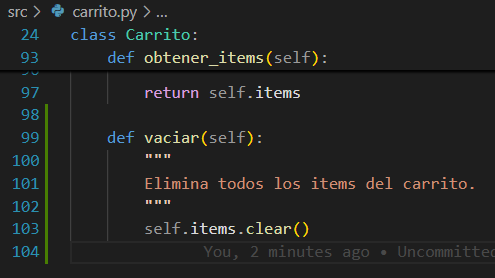
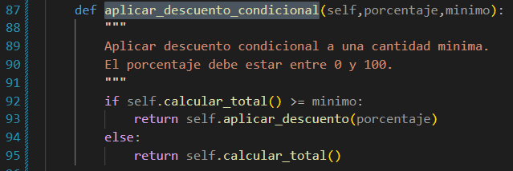
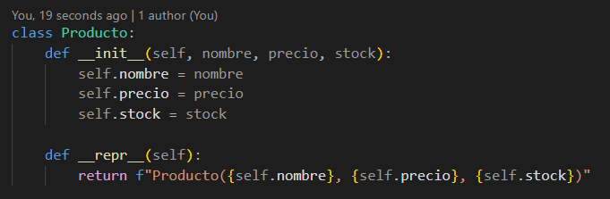
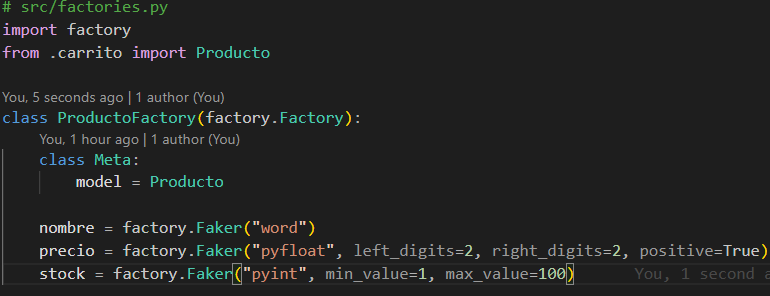
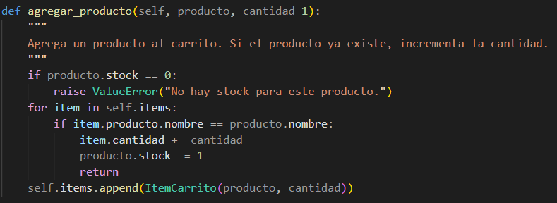
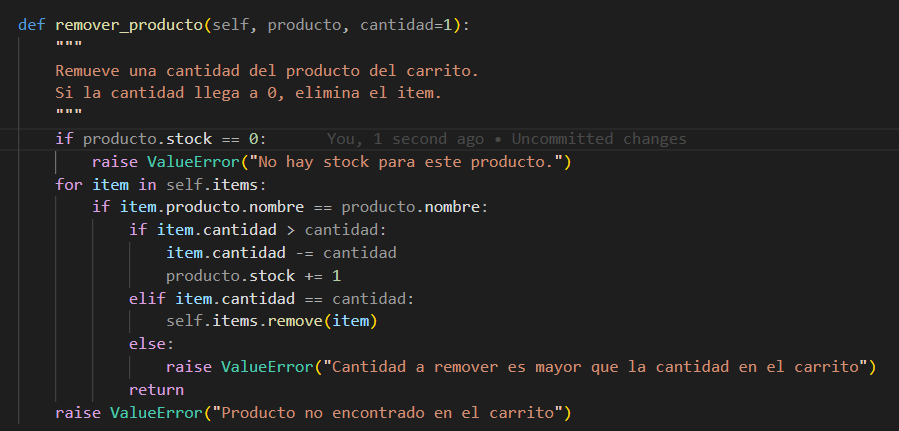
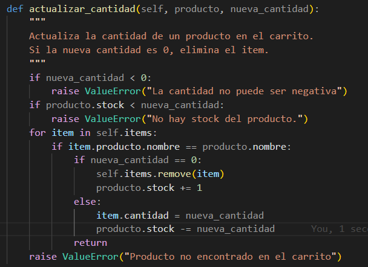
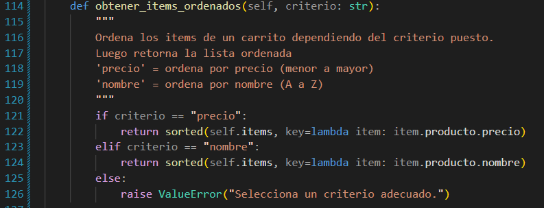
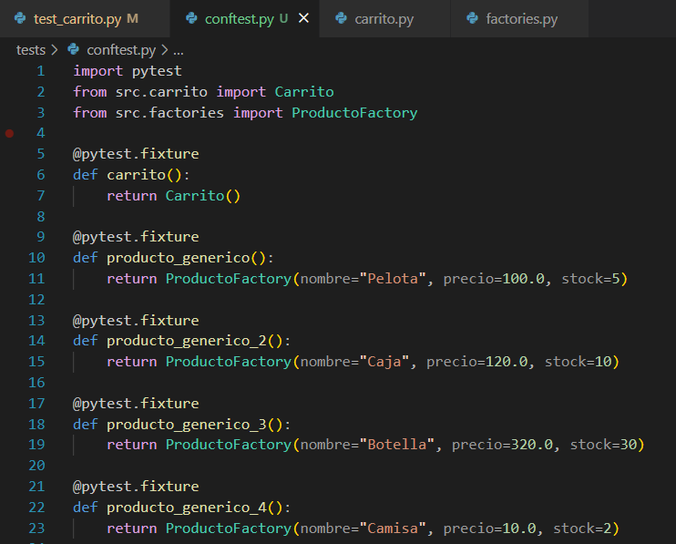

# Ejercicios
## Ejercicio 1: Método para vaciar el carrito
#### Creación del método *vaciar()*: 

### Prueba #1: verificar si el carrito está vacío

### Prueba #2: verificar si el carrito vacío no retorna un total de elementos

## Ejercicio 2: Descuento por compra mínima
#### Creación de la función *aplicar_descuento_condicional()*:

### Prueba #1: Verificar si el descuento condicional se cumple

### Prueba #2: Verificiar si el descuento condicional no se cumple

## Ejercicio 3: Manejo de stock en producto
### Modificación de la clase **Producto** para que tenga un stock

### Modificación de las clases que agreguen o quiten productos del carrito para que tomen en cuenta la existencia de un producto con stock
#### a. agregar_producto():

#### b. remover_producto():

#### c. actualizar_cantidad()

### Prueba #1: Validar si la cantidad del producto agregado está en el límite de stock

### Prueba #2: Lanzar excepción si se agregan más de la cuenta.

## Ejercicio 4: Ordenar items del carrito
### Se creó el método *obtener_items_ordenados()* usando el método sorted() 

### Prueba #1: Verificar si se ordena los productos por nombre

### Prueba #2: Verificar si se ordena los productos por precio

## Ejercicio 5: Uso de Pytest Fixtures
### Creación de fixtures para la refactorización de las pruebas.
##### Para este caso se colocaron 4 productos por los casos de ordenamiento de objetos.

### Refactorización:

# Ejercicio 6: Pruebas parametrizadas
### Prueba #1: Parametrizando pruebas para el método *aplicar descuento*:

## Prueba #2: Parametrizando pruebas para el método *actualizar cantidades*:

# Ejercicio 7: Calcular impuestos en el carrito
#### Red:

### Green:

### Refactor:

# Ejercicio 8: Aplicar cupón de descuento con límite máximo
#### Red:

### Green:

### Refactorizar:

# Ejercicio 9: Validación de stock al agregar productos (RGR)
#### Red:

### Green:

### Refactor:
